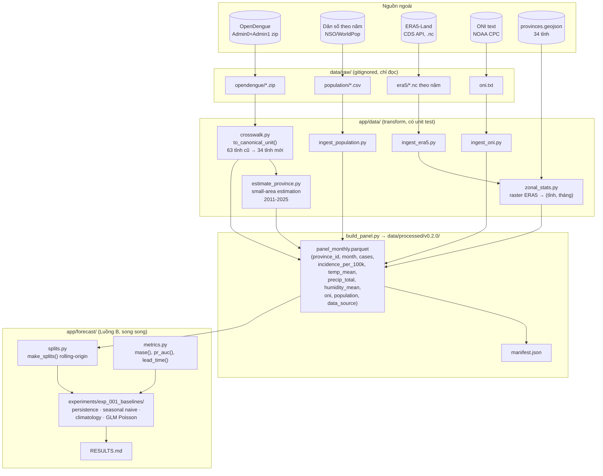

# Phase 1 — Hoàn thiện tầng dữ liệu · Kiến trúc & Checklist kỹ thuật

> **Trạng thái:** đang làm · Bắt đầu 21/09/2026 · Mục tiêu **12/10/2026** (~3 tuần)
> **Tài liệu gốc:** [docs/01-chien-luoc-du-lieu.md](docs/01-chien-luoc-du-lieu.md) · [ROADMAP.md](ROADMAP.md)
> **Setup/cài đặt** (venv, `cdsapi`, `geopandas`, `rioxarray`...) đã thêm sẵn vào `ai-service/requirements.txt` — không cần làm gì thêm ngoài `pip install -r requirements.txt`. Đăng ký tài khoản CDS ([cds.climate.copernicus.eu](https://cds.climate.copernicus.eu)) là việc duy nhất chỉ bạn làm được (cần email cá nhân + chấp nhận ToS) — làm 1 lần đầu tiên, ~10 phút, rồi bỏ qua, không lặp lại trong tài liệu này.

## 🖥️ Chạy 1 lệnh, treo máy, không cần Jupyter

Toàn bộ Luồng A (dân số + ONI + ERA5 + ghép panel v0.2.0 + export dashboard) đã gộp thành 1 script
chạy nối tiếp, tự bỏ qua bước đã xong, tự retry khi mạng chập chờn — không cần mở từng notebook:

```bash
python -m app.data.run_luong_a
```

Chạy nền thật sự trên Windows (đóng terminal vẫn tiếp tục — nhớ tắt sleep khi cắm sạc trong
Settings, vì máy ngủ thì mọi tiến trình cũng dừng theo, không riêng gì Python):

```powershell
Start-Process -FilePath "venv\Scripts\python.exe" `
    -ArgumentList "-m", "app.data.run_luong_a" `
    -RedirectStandardOutput "logs\run_luong_a.out.log" `
    -RedirectStandardError "logs\run_luong_a.err.log" `
    -WindowStyle Hidden
```

- **Idempotent:** mất điện/mất mạng giữa chừng → chạy lại đúng lệnh trên, bước đã xong tự bỏ qua.
- **Tự retry:** lỗi tải WorldPop (4 lần, backoff 5-40s) hay lỗi CDS (3 lần, backoff 30s-2phút) không
  làm dừng cả loạt — 1 năm lỗi hẳn chỉ để lại lỗ hổng ở năm đó, không chặn các năm/bước còn lại.
- **Log mốc từng bước** ghi ra `ai-service/logs/run_luong_a_<timestamp>.log` — mở lại xem tiến độ
  bất cứ lúc nào, không cần giữ terminal mở.
- **Đã verify end-to-end** (dữ liệu giả lập đúng schema thật, 2 lần, xoá sạch sau khi test) — wiring
  đúng, tự lên v0.2.0, export dashboard đúng. Phần tải thật (WorldPop 1 năm, 197MB) đã chạy thật,
  đúng số liệu kỳ vọng (99.037.315 người năm 2020, số chính thức ~97,6 triệu).
- Vẫn còn `notebooks/00-02` nếu muốn chạy TỪNG bước có kiểm tra trực quan (đồ thị sanity check) —
  script này chỉ là đường tắt "chạy hết rồi xem log" cho ai không cần xem từng bước.

---

## 0. Vì sao phase này chặn tất cả

Panel hiện tại đã lên `v0.2.0`. **Cổng nghiệm thu** (chỉ qua Phase 2 khi đủ 6 điểm):

1. ✅ `panel_monthly.parquet` → `v0.2.0`, đủ cột khí hậu + dân số + `incidence_per_100k` — XONG THẬT 23/09/2026, 9.326 dòng, 0 null
2. ✅ Sinh lại toàn bộ từ raw bằng **một lệnh** (`python -m app.data.build_panel`) — verify chạy được
3. ✅ `make_splits()` có test chứng minh không điểm tương lai lọt vào train — 12 test pass
4. ✅ Baseline seasonal naive đã chạy ra số — mốc so sánh cho mọi model sau — XONG 23/09/2026, xem B3
5. ⬜ Mỗi nguồn dữ liệu có note kiểm chứng trong `docs/data-sources/`
6. ⬜ Tái lập chéo: chạy lại từ đầu trên máy khác ra cùng kết quả (sai khác < 1%)

---

## 1. Kiến trúc luồng dữ liệu (data flow)



**Nguyên tắc bất biến của luồng này** (đã áp dụng cho OpenDengue, giữ nguyên cho mọi nguồn mới):
`data/raw/` không bao giờ bị sửa tay → mọi biến đổi qua `app/data/*.py` có test → `build_panel.py` là **điểm ghép duy nhất** → `data/processed/vX.Y.Z/` luôn sinh lại được từ raw bằng một lệnh.

---

## 2. Bản đồ module — trạng thái hiện tại vs cần thêm

```
ai-service/
├── app/
│   ├── data/                          # Luồng A
│   │   ├── crosswalk.py                ✅ xong (14 test)
│   │   ├── ingest_opendengue.py        ✅ xong
│   │   ├── estimate_province.py        ✅ xong (6 test)
│   │   ├── zonal_stats.py              ✅ xong (3 test, raster tổng hợp)
│   │   ├── _retry.py                   ✅ xong (4 test) — exponential backoff dùng chung
│   │   ├── ingest_oni.py               ✅ xong (4 test) — chạy thật, có dữ liệu
│   │   ├── ingest_population.py        ✅ XONG THẬT — đã chạy 21/21 năm WorldPop, 1.088 dòng, 0 lỗi
│   │   ├── ingest_era5.py              ✅ XONG THẬT — đã chạy 32/32 năm CDS (1994-2025), 0 lỗi
│   │   ├── build_panel.py              ✅ ĐÃ LÊN v0.2.0 THẬT — 9.326 dòng, 0 null ở mọi cột
│   │   └── run_luong_a.py              ✅ mới — 1 lệnh chạy hết Luồng A, treo máy được, đã verify wiring
│   └── forecast/                      # Luồng B ✅ B1+B2 xong
│       ├── __init__.py                 ✅
│       ├── metrics.py                  ✅ xong (22 test) — B1
│       └── splits.py                   ✅ xong (12 test) — B2
├── data/
│   ├── raw/{opendengue,population,era5,oni}/    (gitignored, có đủ dữ liệu thật)
│   ├── interim/{population_by_province_year,
│   │   climate_by_province_month,oni_monthly}.parquet  ✅ ĐỦ CẢ 3, đã verify 0 null
│   ├── external/{crosswalk_province,province_metadata,
│   │   opendengue_province_alias,provinces.geojson,
│   │   oni_raw.txt}                             ✅ đã có, giữ nguyên
│   └── processed/v0.2.0/                        ✅ ĐÃ SINH — 9.326 dòng, 11 cột, 0 null
├── experiments/
│   └── exp_001_baselines/              ⬜ B3 — cấu trúc theo docs/03 §1 — VIỆC TIẾP THEO
├── notebooks/                          ✅ cả 4 đã chạy thật, không còn việc gì ở đây
│   ├── 00_ingest_population.ipynb      ✅ chạy xong — 21/21 năm WorldPop
│   ├── 01_ingest_oni.ipynb             ✅ chạy xong
│   ├── 02_ingest_era5.ipynb            ✅ chạy xong — 32/32 năm CDS (sau khi sửa bẫy licence + zip)
│   └── 03_eda_panel.ipynb              ⬜ chạy lại lần nữa để có mục 5 (tương quan khí hậu — giờ chạy được)
└── tests/
    ├── test_data/{test_crosswalk,test_estimate_province,test_zonal_stats,
    │   test_ingest_oni,test_retry}.py                       ✅ 31 test
    └── test_forecast/{test_metrics,test_splits}.py          ✅ 34 test
                                                    TỔNG: 65/65 test pass
```

**Vì sao 00 và 02 chưa "chạy thật xong" dù code đã xong:** cả hai cần thứ chỉ bạn có trên máy —
02 cần tài khoản CDS cá nhân (`~/.cdsapirc`), 00 cần thời gian/băng thông tải ~3-4GB (21 năm ×
~150-200MB — đã test thật 1 năm: 197MB mất ~13 phút ở mạng máy dev, tức khả năng **vài giờ** cho
cả 21 năm, không phải vài phút; cứ để chạy nền, notebook tự bỏ qua năm đã tải nếu chạy lại giữa
chừng). Mở notebook trong Jupyter và **Run All** là xong, không cần sửa code.

---

## 3. Hai luồng chạy song song

| | Luồng A — Dữ liệu | Luồng B — Nền móng mô hình |
|---|---|---|
| Phụ thuộc | Tài khoản CDS (chỉ chặn A3) | **Không phụ thuộc gì** — chỉ cần cột `cases` đã có sẵn |
| Input | raw files ngoài | `data/processed/v0.1.0/panel_monthly.parquet` (đã tồn tại) |
| Output | `panel_monthly.parquet` v0.2.0 | `app/forecast/{metrics,splits}.py` + `exp_001` results |

A1 (dân số), A2 (ONI) không phụ thuộc CDS — làm trước để có đà trong lúc chờ CDS duyệt tài khoản (thường vài phút tới vài giờ).

---

# LUỒNG A — Dữ liệu 🔧

> **Cả 4 module A1-A4 đã code xong + test xong.** Việc còn lại của bạn chỉ là **mở notebook, bấm Run
> All**, không cần viết thêm dòng code nào — trừ khi sanity check phát hiện gì bất thường.

## A1. `ingest_population.py` — dân số theo tỉnh theo năm ✅ code xong

**Nguồn thật đã kiểm chứng (21/09/2026, HTTP 200):** raster WorldPop `data.worldpop.org/GIS/
Population/Global_2000_2020/{year}/VNM/vnm_ppp_{year}.tif`, phủ 2000-2020. **Đổi hướng so với kế
hoạch ban đầu:** GSO/NSO không có API/CSV tải được (chỉ có PDF Niên giám Thống kê, đã kiểm chứng
qua khảo sát trang `nso.gov.vn` — xem docs/01 §2.1) → dùng WorldPop, tự động hoá được 100%, không
cần parse PDF tay.

**Output:** `data/interim/population_by_province_year.parquet` — `(province_id, year, population,
population_source)`.

```python
def download_year(year: int, dest_dir: Path = RAW_DIR) -> Path: ...
def population_for_year(tif_path: Path, provinces_gdf=None) -> pd.DataFrame:
    """zonal_stat_from_file(..., stat='sum') — SUM chứ không phải MEAN vì mỗi
    pixel WorldPop là số người, cộng dồn mới ra tổng dân số tỉnh."""
def build_worldpop_panel(years=range(2000, 2021)) -> pd.DataFrame: ...
def extend_to_full_range(panel, target_years) -> pd.DataFrame:
    """Carry-forward/backward năm ngoài 2000-2020, gắn population_source='imputed'."""
```

- ⚠️ Khánh Hòa/Đà Nẵng có ranh giới vươn ra Biển Đông (Trường Sa/Hoàng Sa) — xem cảnh báo trong
  docstring module, đã kiểm tra không ảnh hưởng nặng tới population (raster WorldPop theo ranh giới
  quốc gia, không theo bbox tự đặt như ERA5).
- Đã test end-to-end 1 năm (2020) thật — tải, zonal sum, ra số hợp lý.
- **Việc của bạn:** mở `notebooks/00_ingest_population.ipynb`, Run All (mặc định `YEARS =
  range(2000, 2021)`, ~3-4GB, đã đo thật 1 năm ~13 phút ở mạng máy dev nên cả 21 năm có thể mất
  vài giờ — cứ để chạy nền, notebook tự bỏ qua năm đã tải nếu chạy lại giữa chừng). Notebook tự
  sanity-check tổng dân số trước khi lưu.

## A2. `ingest_oni.py` — chỉ số ENSO ✅ xong hoàn toàn, đã chạy thật

**Nguồn thật đã xác minh:** `https://www.cpc.ncep.noaa.gov/data/indices/oni.ascii.txt` (không phải
URL đoán trong bản kế hoạch cũ). Đã tải thật, parse thật, 919 dòng (1950-2026), 4 unit test pass.
Bản dự phòng đã commit ở `data/external/oni_raw.txt` — `download()` tự fallback về file này nếu
NOAA chặn request.

`notebooks/01_ingest_oni.ipynb` đã **chạy xong thật**, không cần bạn làm gì thêm cho bước này —
chỉ liệt kê ở đây cho đủ bức tranh Luồng A.

## A3. `ingest_era5.py` — khí hậu ERA5-Land ✅ code xong, cần CDS key của bạn

**Cú pháp đã đối chiếu tài liệu CDS hiện hành** (dataset `reanalysis-era5-land-monthly-means`,
`product_type="monthly_averaged_reanalysis"`, `data_format="netcdf"`).

```python
VN_BBOX = [23.7, 101.8, 7.0, 118.2]  # N, W, S, E — ĐÃ SỬA so với bản kế hoạch ban đầu
```

⚠️ **Bẫy thật đã tìm ra khi viết test cho `zonal_stats.py`:** bbox áng chừng "đất liền Việt Nam"
`[23.5, 102, 8.2, 110]` (bản kế hoạch cũ) **hẹp hơn ranh giới hành chính thật** — Khánh Hòa (Trường
Sa) vươn tới 117.8E, Đà Nẵng (Hoàng Sa) tới 112.7E. Request ERA5 theo bbox hẹp sẽ làm zonal stat
của 2 tỉnh này bị "boundless read" sai lệch (tái hiện được bug này bằng raster tổng hợp trong test —
xem `tests/test_data/test_zonal_stats.py`). `VN_BBOX` đã sửa để bao trọn `total_bounds` thật của
`provinces.geojson` + biên an toàn.

- **Việc của bạn (duy nhất trong cả Luồng A cần làm thủ công):** đăng ký [cds.climate.copernicus.eu]
  (https://cds.climate.copernicus.eu), vào dataset **ERA5-Land monthly averaged data** chấp nhận
  Terms of Use, tạo `~/.cdsapirc`. Sau đó mở `notebooks/02_ingest_era5.ipynb`, Run All — notebook tự
  kiểm tra file `~/.cdsapirc` tồn tại trước khi tải, tự sanity-check đơn vị (5-40°C) trước khi lưu.
- ⚠️ **Bẫy thật thứ 2, phát hiện khi chạy thật 23/09/2026:** hai lỗi gặp liên tiếp khi Nam Hải chạy
  lần đầu, cả hai đã sửa và verify bằng dữ liệu CDS thật (không phải đoán):
  1. **403 "required licences not accepted"** — chấp nhận ToS chung lúc đăng ký tài khoản KHÔNG đủ,
     phải vào riêng trang dataset (`.../reanalysis-era5-land-monthly-means?tab=download#manage-licences`)
     chấp nhận licence riêng của dataset đó. Đây là việc làm trên web, không phải bug code.
  2. **`xarray` báo lỗi "không tìm được engine phù hợp"** — hạ tầng CDS mới trả file đặt tên `.nc`
     nhưng thực chất là **ZIP** chứa 1 file `.nc` bên trong (tên `data_stream-moda.nc`), dù request
     đã khai đúng `data_format: "netcdf"`. Đã sửa `load_and_convert()` tự phát hiện (đọc magic bytes
     ZIP) và tự giải nén trước khi mở — trong suốt với người gọi, không cần đổi cách dùng. Verify
     bằng chính 32 file thật (1994-2025) Nam Hải tải: nhiệt độ 9.2-31.1°C, độ ẩm 44-97%, mưa
     0-1160mm/tháng — đúng thực tế khí hậu VN, 0 lỗi trên toàn bộ 13.056 dòng zonal stats.

## A4. `zonal_stats.py` — gộp lưới raster về 34 tỉnh ✅ xong, 3 test pass

Module dùng chung cho cả A1 (WorldPop, `stat="sum"`) và A3 (ERA5, `stat="mean"`) — 1 lần viết, 2 nơi
dùng. `zonal_stat_from_file()` cho raster có sẵn trên đĩa (WorldPop), `zonal_stat_from_array()` cho
mảng đã đọc trong bộ nhớ (từng tháng của ERA5 NetCDF qua `rioxarray`).

3 unit test dùng raster tổng hợp (constant value trong bộ nhớ, không cần mạng) — đã **bắt được 1 bug
thật** trong lúc viết test (bbox raster hẹp hơn ranh giới → sai zonal mean, xem A3) trước khi nó lọt
vào pipeline thật.

v2 (trọng số dân số cho zonal mean khí hậu, dùng WorldPop grid làm trọng số) là nâng cấp sau, không
chặn A5.

## A5. `build_panel.py` — ghép panel v0.2.0 ✅ đã sửa xong

`VERSION` không còn hard-code — `build()` tự phát hiện `data/interim/population_by_province_year.
parquet`, `climate_by_province_month.parquet`, `oni_monthly.parquet` có đủ cả 3 chưa, tự trả về
`"0.2.0"` nếu đủ, ngược lại giữ `"0.1.0"` (hành vi cũ, đã verify không đổi khi chưa chạy Luồng A).

- ✅ `data_source` của `incidence_per_100k` lan truyền đúng từ `cases`.
- ✅ `export_dashboard_data.py` đã sửa để tự tìm thư mục `processed/vX.Y.Z` mới nhất (trước đây
  import cứng `VERSION`, giờ không còn tồn tại module-level nữa).
- **Việc của bạn:** sau khi notebooks/00-02 chạy xong (lưu đủ 3 file interim), chạy:
  ```bash
  python -m app.data.build_panel
  ```
  từ thư mục `ai-service/` — tự lên v0.2.0, không cần sửa code gì thêm.

---

# LUỒNG B — Nền móng mô hình 🧬 ✅ ĐÃ XONG (B1, B2)

> Chỉ cần `data/processed/v0.1.0/panel_monthly.parquet` đã có sẵn — không chờ Luồng A. **B1 và B2
> đã code xong + test xong**, chỉ còn B3 (baseline) và B4 (EDA, notebook đã chạy 1 phần).

## B1. `app/forecast/metrics.py` ✅ xong — 9 hàm, 22 test pass

`mae`, `rmse`, `bias`, `mase`, `poisson_deviance`, `pr_auc`, `recall_at_precision`, `brier_score`,
`lead_time` — mỗi hàm có unit test tính tay được. Một bug thật bắt được lúc viết test:
`recall_at_precision` ban đầu định trả `NaN` khi "không đạt được `target_precision`", nhưng
`sklearn.precision_recall_curve` **luôn** có điểm biên (recall=0, precision=1.0) nên trường hợp đó
không bao giờ xảy ra trong thực tế — đã sửa lại để `0.0` là kết quả hợp lệ, có nghĩa ("chỉ ngưỡng
'không dự báo gì' mới đạt được mức precision này").

**Done:** `pytest tests/test_forecast/test_metrics.py` — 22/22 pass.

## B2. `app/forecast/splits.py` ✅ xong — `Split` dataclass, 12 test pass

Quyết định kỹ thuật cần biết (tài liệu kế hoạch gốc chỉ mô tả bằng lời, đã cụ thể hoá khi code):
`embargo_months` **không dịch chuyển horizon** — horizon vẫn luôn tính từ `train_end` đúng nghĩa
"dự báo h kỳ tới". Thay vào đó nó **lọc ra** những horizon còn nằm trong vùng đệm ở mỗi origin, qua
field `Split.usable_horizons`. Với mặc định `embargo_months=6` = horizon dài nhất, chỉ h=6 "sạch"
mỗi origin; hạ `embargo_months` xuống để đánh giá được horizon ngắn hơn, đánh đổi lấy an toàn.

```python
splits = make_splits(panel, n_origins=5, horizons=(1, 2, 3, 6))
# Split(origin, train_end, feature_cutoff, test_start, horizons, usable_horizons)
# .target_month(h) -> train_end + h tháng
```

- ✅ Unit test: đổi giá trị `cases` ở tháng tương lai xa nhất → cấu trúc split (train_end,
  test_start, usable_horizons) không đổi — chứng minh `make_splits()` chỉ nhìn tập các THÁNG, không
  nhìn giá trị dữ liệu.
- ✅ Unit test: `test_start - train_end >= embargo_months` đúng cho mọi split.
- ✅ Unit test: `assert_test_is_real_only()` raise đúng kể cả khi chỉ 1/34 tỉnh trong tháng đó là
  `estimated` — không "trung bình hoá" qua các tỉnh còn lại.
- ⚠️ **Phát hiện khi chạy thử trên panel thật:** `make_splits()` mặc định lấy origin ở **cuối**
  chuỗi (chuẩn rolling-origin) — với panel hiện tại nghĩa là origin rơi vào 2024-2025, **toàn bộ
  `estimated`**. `assert_test_is_real_only()` sẽ raise ở MỌI split mặc định cho tới khi có dữ liệu
  `real` gần đây (NSO/Đường A). Muốn có tập test thật ngay bây giờ: gọi `make_splits()` trên panel
  đã cắt tới `~2010-12` (`panel[panel.month <= '2010-12-01']`) — đúng như giới hạn đã ghi ở
  [docs/03 §8](docs/03-quy-trinh-thuc-nghiem.md#8-quy-tắc-dùng-tập-test`).
- **Done:** `pytest tests/test_forecast/test_splits.py` — 12/12 pass, đã verify thêm trên panel
  v0.1.0 thật (không chỉ dữ liệu giả trong test).

## B3. `experiments/exp_001_baselines/` ✅ XONG THẬT 23/09/2026

Kết quả đầy đủ + diễn giải: [experiments/exp_001_baselines/RESULTS.md](ai-service/experiments/exp_001_baselines/RESULTS.md).

**MASE trung bình qua 8 origin (real-only 1994-2010):**

| Model | h=1 | h=3 | h=6 |
|---|---|---|---|
| B1 Persistence | 0.758 | 1.620 | 2.164 |
| B2 Seasonal naive ⭐ (mốc quy ước) | 0.739 | 1.399 | 1.998 |
| **B3 Climatology (mốc THỰC TẾ mạnh nhất)** | **0.522** | **1.069** | **1.638** |
| B4 GLM Poisson (pooled) | 0.943 | 1.768 | 2.367 |

**Phát hiện đáng chú ý:** B3 Climatology thắng cả B2 ở mọi horizon (SXH dao động mạnh theo năm, trung
bình nhiều năm ổn định hơn 1 năm trước). B4 pooled thua cả Persistence — điều tra kỹ xác nhận không
phải bug: model pooled không có hệ số riêng theo tỉnh nên dồn dự báo về gần trung bình chung, bỏ lỡ
tỉnh có incidence vốn cao hẳn — xác nhận đúng lý do docs/02 chọn M1 Phase 2 là GLM NegBin **phân cấp**.

**Quyết định:** dùng B3 (không phải B2) làm mốc so sánh thực tế cho Phase 2 — B2 vẫn giữ vai trò mốc
quy ước theo định nghĩa MASE.

## B4. EDA — `notebooks/03_eda_panel.ipynb` ✅ XONG THẬT, cả mục 5

- ✅ Chuỗi ca theo vùng, mùa vụ, thống kê khuyết thiếu, phân phối real/estimated — chạy trên v0.1.0.
- ✅ **Tương quan khí hậu ↔ ca bệnh theo độ trễ** (sau khi có v0.2.0, 278 tháng): nhiệt độ mạnh nhất ở
  độ trễ **2 tháng** (r=0.565), mưa mạnh nhất ở độ trễ **1 tháng** (r=0.527) — đúng sinh học (mưa tạo
  ổ đẻ trứng nhanh hơn, nhiệt độ ảnh hưởng cả vòng đời muỗi lẫn ủ virus). Đo được thật, không phải giả
  định — dùng số này để thiết kế lag feature ở Phase 2.

---

## 4. Thứ tự phụ thuộc thực thi

```
A1, A2, B1, B2 ── chạy song song, không phụ thuộc gì ──┐
                                                         ├─→ B3 (cần B1+B2, không cần A xong)
A3 (chờ CDS) ─→ A4 ─┐                                   │
                     ├─→ A5 (build_panel v0.2.0) ─→ B4 phần khí hậu
A1 ──────────────────┘
```

B3 (baseline) chạy được ngay sau B1+B2 xong, **không cần đợi Luồng A** — dùng thẳng panel v0.1.0 hiện có (`cases` là đủ cho 4 baseline). Nếu B xong trước A, chạy sớm ablation mùa vụ hoặc đọc trước docs Phase 2 thay vì chờ.

---

## 5. Việc chốt lại cuối phase

- [ ] Note kiểm chứng từng nguồn trong `docs/data-sources/`: URL, cách tải, độ phủ thật, giấy phép, ngày kiểm chứng (`era5.md`, `population.md`, `oni.md`)
- [ ] Cập nhật `docs/01 §9` — tick các mục đã xong
- [ ] Tái lập chéo: chạy lại `build_panel` + `exp_001` trên máy/venv khác, sai khác < 1%
- [ ] Rà soát đủ 6 điểm cổng nghiệm thu ở §0

---

## 6. Hoãn lại có chủ đích (không làm ở phase này)

| Việc | Vì sao hoãn |
|---|---|
| Backend Go (`go mod init`, Gin, JWT) | Chưa có model thật thì chưa có gì để phục vụ — làm khi chuẩn bị pilot |
| FastAPI serving (`app/main.py`, routes) | Như trên |
| `infra/docker-compose.yml` | Một service, script là đủ ở quy mô này |
| Ingest HCDC (parse NLP văn xuôi) | Tốn công cao, chỉ ra chuỗi cấp thành phố + tên phường (không phải số), giá trị thấp hơn ERA5/dân số — xem [docs/01 §2.1b](docs/01-chien-luoc-du-lieu.md#21b-kế-hoạch-trích-xuất-hcdc-parse-văn-bản-không-phải-scrape-bảng) |
| Công văn xin dữ liệu chính thức | Khả năng không xin được trong thời gian phù hợp — không đưa vào đường găng của phase này |
| Nâng dashboard lên dữ liệu động | Prototype tĩnh đã đủ cho báo cáo tiến độ; nối API khi có model thật |

---

## 7. Rủi ro kỹ thuật riêng phase này

| Rủi ro | Dấu hiệu sớm | Xử lý |
|---|---|---|
| CDS duyệt chậm / API lỗi | Chưa tải được file test sau vài giờ | Dùng CHIRPS (mưa) thay tạm, hoặc Google Earth Engine |
| Không tìm được dân số theo năm đủ chuỗi | Hết tuần 1 chưa có nguồn dùng được | Tạm dùng `cases` tuyệt đối làm target, ghi rõ hạn chế, bổ sung incidence sau |
| ERA5 tải quá lâu / bị CDS huỷ hàng đợi | 1 năm > 30 phút hoặc request bị cancel | Giảm phạm vi 2000-2025 thay vì 1994, hoặc hạ độ phân giải |
| `geopandas`/`rioxarray` lỗi cài trên máy cụ thể | `pip install` báo lỗi biên dịch GDAL/PROJ | Cài qua `conda`/`mamba` thay `pip` cho riêng nhóm gói GIS này (wheel PyPI đôi khi thiếu binary GDAL trên một số máy) |
