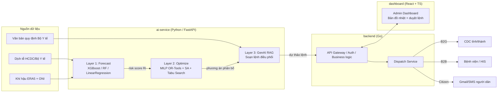

# DengueSense

> Nền tảng AI hỗ trợ ra quyết định y tế công cộng khép kín cho sốt xuất huyết: dự báo dịch sớm 1-6 tháng, tối ưu phân bổ nguồn lực, và tự động soạn lệnh điều phối bằng GenAI.
>
> Đội thi **MedSentinel** — Cuộc thi Sáng tạo Trẻ 2026

## 1. Tổng quan

DengueSense chuyển quy trình phòng chống sốt xuất huyết từ **bị động** sang **chủ động**, khép kín 3 lớp:

1. **Dự báo (Forecast)** — mô hình ML dự báo rủi ro dịch theo khu vực từ dữ liệu dịch tễ + khí hậu.
2. **Tối ưu (Optimize)** — thuật toán tối ưu phân bổ giường bệnh, vật tư, nhân lực theo ngân sách.
3. **Điều phối (Dispatch)** — GenAI soạn thảo lệnh điều phối / cảnh báo, con người luôn duyệt cuối (human-in-the-loop).

Chi tiết bài toán, thị trường, tài chính: xem bản thuyết minh đề án (không lưu trong repo này).

## 2. Kiến trúc hệ thống



`backend` chỉ gọi `ai-service` qua REST nội bộ (JSON/OpenAPI) — không gọi thẳng model từ frontend, không để Go tự implement lại logic ML/optimize.

## 3. Tech stack đã chốt

| Lớp | Công nghệ | Lý do chọn |
|---|---|---|
| Backend / API / Dispatch | **Go** + Gin | Hiệu năng cao, phù hợp người phụ trách fullstack/devops, dễ deploy binary gọn |
| AI Service (Forecast + Optimize + RAG) | **Python** + FastAPI | Hệ sinh thái ML/optimize (XGBoost, OR-Tools, LangChain) chỉ mature ở Python; FastAPI tự sinh OpenAPI spec cho Go gọi vào |
| Forecast (Layer 1) | XGBoost, scikit-learn (RandomForest, LinearRegression), pandas, TimeSeriesSplit | Đúng như đã báo cáo, không đổi |
| Optimize (Layer 2) | Google **OR-Tools** (MILP/CP-SAT) + Simulated Annealing/Tabu Search tự viết (numpy) | OR-Tools là chuẩn công nghiệp cho MILP, free, Python-first |
| GenAI RAG (Layer 3) | LangChain (hoặc llama-index) + **pgvector** trên Postgres, LLM qua API (Claude/OpenAI, cấu hình qua `.env`) | Dùng chung 1 Postgres cho cả geo-data và vector-store thay vì thêm 1 DB riêng → giảm chi phí vận hành, đúng tinh thần "chi phí thấp" của đề án |
| Frontend | React + TypeScript + Vite, TailwindCSS, Leaflet (bản đồ nhiệt), Framer Motion, TanStack Query, Zustand | Đúng như đã báo cáo; Zustand thay Redux vì team nhỏ, ít boilerplate |
| Database | **PostgreSQL + PostGIS** (geo theo quận/huyện) + pgvector (RAG) | 1 DB duy nhất cho MVP, giảm số service phải vận hành |
| Cache / Queue | Redis — **chỉ thêm khi vào giai đoạn pilot/scale**, MVP chưa cần | Tránh over-engineering cho bản demo/pilot đầu |
| Auth | JWT (access/refresh), OAuth2 cho tích hợp HIS sau này | Theo đúng phương án giảm rủi ro bảo mật đã cam kết trong đề án |
| Hạ tầng | Docker + Docker Compose (dev/pilot), GitHub Actions CI, 1 VM Cloud (AWS/GCP) cho pilot 2 tỉnh | Portable, không cần Kubernetes ở giai đoạn MVP/pilot |
| Data pipeline & fallback | Cron job (Python) kéo ERA5 + báo cáo ca bệnh; ARIMA nội suy khi mất kết nối | **Roadmap giai đoạn 2**, không chặn MVP |

**Nguyên tắc chọn stack:** ưu tiên công nghệ cả 2 bạn tech đã có sẵn kinh nghiệm (Go/React/DevOps + AI Agent/Python), tối thiểu số service phải vận hành, và không thêm hạ tầng nào chưa cần dùng ngay ở MVP.

## 4. Cấu trúc thư mục (monorepo)

```
DengueSense/
├── backend/            # Go: API gateway, auth, dispatch, business logic
├── ai-service/         # Python: forecast (Layer 1), optimize (Layer 2), GenAI RAG (Layer 3)
├── dashboard/           # React + TS + Vite: Admin Dashboard
├── infra/                # docker-compose, deploy scripts, env templates
├── docs/                  # ⭐ phương pháp luận: dữ liệu, mô hình, thực nghiệm
├── .github/
│   ├── workflows/         # CI cho từng service
│   └── pull_request_template.md
├── CONTRIBUTING.md         # quy tắc code & git — đọc trước khi PR
└── README.md
```

Mỗi thư mục service có README riêng mô tả cách chạy local — xem [backend/README.md](backend/README.md), [ai-service/README.md](ai-service/README.md), [dashboard/README.md](dashboard/README.md).

## 5. Bắt đầu nhanh

Repo mới khởi tạo cấu trúc, code từng service sẽ được scaffold khi bắt đầu implement:

```bash
git clone <repo-url>
cd DengueSense
```

Sau khi mỗi service có manifest (`go.mod`, `requirements.txt`, `package.json`), chạy toàn bộ stack bằng:

```bash
docker compose -f infra/docker-compose.yml up
```

## 5b. Deploy prototype (Vercel)

`dashboard/` là prototype trực quan (chi tiết cái gì thật/cái gì minh hoạ: [dashboard/README.md](dashboard/README.md)). Deploy lên Vercel:

1. Đăng nhập [vercel.com](https://vercel.com) bằng GitHub
2. **Add New → Project → Import** repo `DengueSense`
3. Ở bước cấu hình: **Root Directory** đổi thành `dashboard` (bấm Edit cạnh Root Directory)
4. Framework Preset: Vercel tự nhận diện **Vite** — để mặc định (Build: `npm run build`, Output: `dist`)
5. **Deploy**

Không cần biến môi trường nào — toàn bộ dữ liệu là file JSON tĩnh trong `dashboard/public/data/`. Mỗi lần push nhánh này lên GitHub, Vercel tự build lại và cập nhật link.

## 6. Quy tắc làm việc & đóng góp code

**Đọc [CONTRIBUTING.md](CONTRIBUTING.md) trước khi tạo branch/PR đầu tiên** — quy tắc git, coding convention, CI.

## 6b. Phương pháp luận kỹ thuật ⭐

Trước khi bắt tay vào dữ liệu hoặc train model, đọc bộ tài liệu trong **[docs/](docs/README.md)**:

| # | Tài liệu | Nội dung |
|---|---|---|
| 00 | [Review hiện trạng](docs/00-review-hien-trang.md) | Rà soát đề án: rủi ro, mâu thuẫn số liệu cần sửa |
| 01 | [Chiến lược dữ liệu](docs/01-chien-luoc-du-lieu.md) | Nguồn dữ liệu, chuẩn hoá ranh giới hành chính, chia tập, chống rò rỉ |
| 02 | [Phương pháp mô hình](docs/02-phuong-phap-mo-hinh.md) | 4 baseline + 10 model, 4 phương pháp tuning, ensemble, metric, cổng quyết định |
| 03 | [Quy trình thực nghiệm](docs/03-quy-trinh-thuc-nghiem.md) | Đánh số thí nghiệm, MLflow tracking, tái lập, quy tắc dùng tập test |
| 04 | [Phương pháp tối ưu](docs/04-phuong-phap-toi-uu.md) | Formulation, so sánh 5 solver, đánh giá dưới bất định |
| 05 | [Phương pháp GenAI RAG](docs/05-phuong-phap-genai-rag.md) | Kiến trúc RAG, guardrail, bộ đánh giá |
| 06 | [**Khảo sát tài liệu & Định vị khác biệt**](docs/06-khao-sat-tai-lieu.md) | ⭐ Benchmark thật (D-MOSS, EWARS, PLOS NTD), 5 khác biệt K1–K5, chốt model & tuning |
| 07 | [**Model Card — Layer 1**](docs/07-model-card.md) | ⭐ Hiệu năng đo được, độ vững, SHAP, **12 giới hạn đã biết có số đo**, khuyến nghị vận hành (mọi con số có nguồn experiment) |
| 08 | [**Bàn giao Layer 1**](docs/08-ban-giao-layer1.md) | ⭐ Tổng kết đầy đủ để đồng đội tiếp nhận: bản đồ code, kỷ luật đánh giá, 15 thí nghiệm, hướng đã thất bại, ý tưởng chưa thử |

Ba nguyên tắc xuyên suốt: **không có baseline thì không có kết quả** · **tập test chỉ chạm một lần** · **số nào đưa vào hồ sơ thì phải chạy lại được**.

## 7. Theo dõi tiến độ

> 🔴 **Đang làm:** Phase 1 — hoàn thiện tầng dữ liệu (21/09 → 12/10/2026).
> Checklist thi hành hằng ngày: **[PHASE-1-CHECKLIST.md](PHASE-1-CHECKLIST.md)**

| Phase | Thời gian | Trọng tâm | Trạng thái |
|---|---|---|---|
| 0 — Solo Bootstrap | — | Backend, FastAPI, infra | ⏸️ Hoãn có chủ đích → gộp vào Phase 5 |
| **1 — Dữ liệu** | **21/09 – 12/10/2026** | **Khí hậu, dân số, splits, baseline** | 🔴 **Đang làm (~40%)** |
| 2 — Mô hình Layer 1 | 13/10 – 22/11/2026 | 4 model Tier 1, tuning, ensemble | ⏳ Chờ |
| 3 — Tối ưu Layer 2 | 23/11 – 13/12/2026 | MILP, đánh giá dưới bất định | ⏳ Chờ |
| 4 — GenAI RAG Layer 3 | 14/12/2026 – 31/01/2027 | Guardrail, bộ vàng | ⏳ Chờ |
| 5 — Tích hợp & Pilot | 01/02 – 15/03/2027 | Backend, dispatch, bảo mật | ⏳ Chờ |
| 6 — Pilot thực địa | Q2/2027 | 1-2 bệnh viện/CDC, case study | ⏳ Chờ |

Danh sách task chi tiết theo từng phase (có checkbox, phân owner): xem **[ROADMAP.md](ROADMAP.md)**.

Dùng **GitHub Issues + Projects (Kanban)** cho task lớn, không theo dõi qua chat để tránh thất lạc.

Mỗi issue gắn nhãn `backend` / `ai-service` / `dashboard` / `infra` và milestone tương ứng; PR phải link issue (`closes #x`).

## 8. Team Tech

| Thành viên | Vai trò | Mảng phụ trách |
|---|---|---|
| Nguyễn Đào Nam Hải | Tech Lead | Fullstack, DevOps, AI Agent, Computer Vision — chủ trì `backend`, `infra`, kiến trúc chung |
| Đồng Minh Dương | AI/ML Engineer | AI Agent, Y sinh — chủ trì `ai-service` (Layer 1/2/3) |
