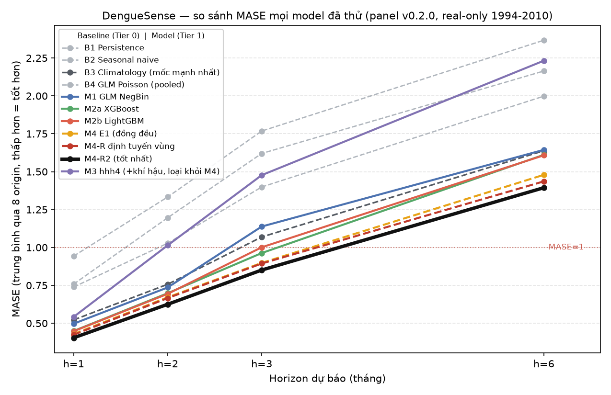

# Model zoo — bảng xếp hạng tổng hợp

> **Nguồn sự thật duy nhất** cho kết quả so sánh model. Chi tiết đầy đủ (thiết lập, bug gặp phải, chẩn
> đoán điều bất ngờ) nằm ở `RESULTS.md` của từng experiment — file này chỉ gộp lại số cuối cùng để
> không phải lục 4 file mỗi lần cần so sánh. **Cập nhật file này mỗi khi có experiment mới** (M4
> ensemble, M3 bản có khí hậu, ...) — thêm 1 hàng vào bảng + 1 dòng vào `plot_leaderboard.py::RESULTS`
> rồi chạy lại `python experiments/plot_leaderboard.py`.

- **Data version:** panel v0.2.0 (`ai-service/data/processed/v0.2.0/panel_monthly.parquet`)
- **Giao thức chung (mọi experiment dưới đây dùng y hệt):** rolling-origin mở rộng, **8 origin**
  (`train_end` 2009-11 → 2010-06), horizon **{1, 2, 3, 6} tháng**, `embargo_months=1`,
  `reporting_delay_months=1`, tập test **100% `data_source=="real"`** (`assert_test_is_real_only()`),
  metric chính **MASE** (mẫu số = sai số seasonal-naive trên phần train của từng origin).
- **Cập nhật lần cuối:** 2026-09-24 (sau exp_008 — M4-R2)

## Biểu đồ

_(sinh bằng `python experiments/plot_leaderboard.py`, xem file đó để sửa số liệu/style)_

## Bảng đầy đủ

| # | Model | Tier | h=1 | h=2 | h=3 | h=6 | Nguồn |
|---|---|---|---|---|---|---|---|
| B1 | Persistence | 0 (baseline) | 0.758 | 1.196 | 1.620 | 2.164 | [exp_001](exp_001_baselines/RESULTS.md) |
| B2 | Seasonal naive ⭐ mốc quy ước | 0 (baseline) | 0.739 | 1.028 | 1.399 | 1.998 | [exp_001](exp_001_baselines/RESULTS.md) |
| B3 | Climatology ⭐ mốc thực tế mạnh nhất | 0 (baseline) | 0.522 | 0.757 | 1.069 | 1.638 | [exp_001](exp_001_baselines/RESULTS.md) |
| B4 | GLM Poisson (pooled) | 0 (baseline) | 0.943 | 1.333 | 1.768 | 2.367 | [exp_001](exp_001_baselines/RESULTS.md) |
| M1 | GLM NegBin (fixed-effect theo tỉnh) | 1 (T1 default) | 0.497 | 0.736 | 1.138 | 1.644 | [exp_002](exp_002_model_zoo_tier1/RESULTS.md) |
| M2a | XGBoost | 1 (T1 default) | 0.449 | 0.698 | 0.963 | 1.611 | [exp_002](exp_002_model_zoo_tier1/RESULTS.md) |
| M2b | LightGBM (đơn lẻ tốt nhất) | 1 (T1 default) | 0.447 | 0.694 | 1.001 | 1.608 | [exp_002](exp_002_model_zoo_tier1/RESULTS.md) |
| M4-R2 | **Ensemble định tuyến vùng + pha Climatology cho Nam 🏆 tốt nhất hiện tại** | 1 (ensemble) | **0.404** | **0.625** | **0.851** | **1.394** | [exp_008](exp_008_outbreak_north/RESULTS.md) |
| M4-R | Ensemble E1 định tuyến vùng (Bắc→V3 scale-aware) | 1 (ensemble) | 0.424 | 0.666 | 0.894 | 1.436 | [exp_007](exp_007_scale_aware/RESULTS.md) |
| M4 | Ensemble E1 (M1+M2a+M2b) | 1 (ensemble) | 0.429 | 0.671 | 0.898 | 1.479 | [exp_005](exp_005_m4_ensemble/RESULTS.md) |
| M4 | Ensemble E2 (có trọng số) | 1 (ensemble) | 0.430 | 0.674 | 0.907 | 1.492 | [exp_005](exp_005_m4_ensemble/RESULTS.md) |
| M3 | hhh4 v1 (không khí hậu) | 1 (T1) | 0.544 | 1.038 | 1.527 | 2.406 | [exp_004](exp_004_m3_hhh4/RESULTS.md) |
| M3 | **hhh4 v2 (+climatology khí hậu theo tỉnh)** | 1 (T1) | 0.542 | 1.014 | 1.477 | 2.232 | [exp_004](exp_004_m3_hhh4/RESULTS.md) |
| — | M2a XGBoost, T2 tuned (inner=5 origin) | 2 (tuning) | — | — | — | — | outer gộp 0.9764 (TỆ HƠN T1's 0.9304, −4.9%) — [exp_003](exp_003_tuning_m2/RESULTS.md) |
| — | M2b LightGBM, T2 tuned (inner=5 origin) | 2 (tuning) | — | — | — | — | outer gộp 0.9368 (≈T1's 0.9374, +0.1%) — [exp_003](exp_003_tuning_m2/RESULTS.md) |
| — | M2a XGBoost, **T2 tuned (inner=15 origin, kiểm chứng lại)** | 2 (tuning) | — | — | — | — | outer gộp 0.9470 (TỆ HƠN T1, −1.8%) — [exp_003](exp_003_tuning_m2/RESULTS.md) |
| — | M2b LightGBM, **T2 tuned (inner=15 origin, kiểm chứng lại)** | 2 (tuning) | — | — | — | — | outer gộp 0.9408 (TỆ HƠN T1, −0.4%) — [exp_003](exp_003_tuning_m2/RESULTS.md) |

_(std qua 8 origin và MAE chi tiết: xem `results.json` trong từng thư mục experiment)_

## Đọc nhanh

1. **M4 Ensemble E1 (trung bình đơn giản M1+M2a+M2b) là model tốt nhất** ở mọi horizon, thắng model
   đơn lẻ tốt nhất 3.9/3.3/6.8/8.0% (h=1/2/3/6) — vượt ngưỡng ≥3% của docs/02 §7, thắng đa số fold
   (21/32 vs M2b, 27/32 vs M2a). E2 (có trọng số) không tốt hơn E1. Model đơn lẻ tốt nhất vẫn là
   M2a/M2b, thắng B3 khiêm tốn (2-14%).
2. **T2 tuning (Optuna 100 trial) không cải thiện được gì — đã kiểm chứng lại 2 lần, kết luận vững.**
   Lần 1 (inner=5 origin): XGBoost tệ hơn (-4.9%), LightGBM không đổi. Nghi ngờ inner quá nhỏ khiến
   XGBoost chưa hội tụ (đường hội tụ vẫn đang giảm ở trial 100) → tăng inner lên 15 origin để kiểm tra
   lại. Lần 2 (inner=15 origin): XGBoost NAY ĐÃ HỘI TỤ SẠCH (phẳng từ trial ~30) — giả thuyết "inner
   quá nhỏ" được xác nhận đúng cho việc TÌM tham số — nhưng **outer vẫn KHÔNG cải thiện** (XGBoost
   -1.8%, LightGBM -0.4%, cả 2 đều vẫn tệ hơn T1). Kết luận cập nhật: nguyên nhân gốc không phải thiếu
   dữ liệu tuning, mà là **dịch chuyển phân phối theo thời gian** — tham số tối ưu cho giai đoạn tuning
   không nhất thiết tối ưu cho giai đoạn đánh giá. **Quyết định (vững, đã kiểm chứng 2 lần): dùng T1
   default cho M4 ensemble.**
3. **M3 hhh4 thua mọi model khác ở mọi horizon**, kể cả 2 baseline. Thêm covariate khí hậu
   (climatology theo tỉnh) cải thiện THẬT (0.4-7.2%, tăng dần theo horizon) nhưng KHÔNG đủ lấp khoảng
   cách — chẩn đoán: climatology chỉ bắt mùa vụ trung bình, không bắt được bất thường khí hậu liên năm
   mà M1/M2's khí hậu lag thực đo có. **Quyết định: vẫn loại M3 khỏi M4 ensemble** — xem exp_004
   "Việc tiếp theo" cho hướng khả thi tiếp theo (ONI lag đủ xa, leak-safe).
4. **M4 E1 đạt ngưỡng G1** (docs/02 §10: MASE<0.90 ở CẢ h=1 và h=3): 0.429 ✅ và 0.8975 ✅ — nhưng h=3
   sát ngưỡng (std giữa origin lớn), cần thêm robustness/LOPO trước khi coi là chắc chắn.

5. **Phân rã M4 (exp_006, docs/02 §4.2) — điểm yếu cần ghi vào model card:** với mẫu số riêng từng vùng,
   M4 có kỹ năng thật ở Nam (MASE 0.80) và Trung (0.90) nhưng **thua seasonal-naive ở miền Bắc (1.755)**;
   ở tháng bùng dịch (p90 theo tỉnh) MASE 2.56 vs 0.50 tháng thường, bias −15 ca/100k, 38.7% ca bùng dịch bị
   dự báo thấp hơn thực tế hơn một nửa. **LOPO (§4.3):** bỏ hẳn 1 tỉnh khỏi train chỉ kém đi +0.9% (ensemble
   GBM) — ủng hộ luận điểm nhân rộng, kèm điều kiện tỉnh mới có lịch sử địa phương.

6. **Sửa điểm yếu M4 (exp_007):** chỉ thêm đặc trưng quy mô tỉnh không giúp (còn tệ hơn); phải dự báo TỈ LỆ so
   với quy mô lịch sử (V3). V3 toàn cục là đánh đổi (Bắc −22% nhưng h=1 +12%, phá G1 ở h=3). **M4-R = định tuyến
   theo vùng (Bắc→V3, còn lại giữ M4)**, chọn bằng validation: cải thiện mọi horizon (gộp 0.8693→0.8552), giữ G1,
   Bắc 1.755→1.366 (**vẫn >1, chưa thắng seasonal-naive**). Bias bùng dịch (−15) KHÔNG sửa được bằng quy mô hay
   isotonic (isotonic làm tệ hơn).

7. **M4-R2 (exp_008) — bản hiện hành:** thêm đòn bẩy theo vùng chọn bằng validation (Bắc: Tweedie, Nam: pha 50%
   Climatology, Trung: giữ nguyên). Gộp 0.8552→**0.8185** (−4.3%), thắng 27/32 fold, G1 có biên tốt hơn
   (h=1 0.404, h=3 0.851). Cải thiện đến gần hết từ **Nam (−10%)**; Bắc-Tweedie (−44% validation) **không tái
   lập** ở outer. **Vẫn chưa sửa được:** miền Bắc 1.373 (>1), bias bùng dịch −15.5 (thử 3 hướng: quy mô, isotonic,
   trọng số/Tweedie — đều đánh đổi hoặc không có tác dụng). Cần tín hiệu mới, không chỉ đổi loss.

## Trạng thái model zoo (docs/02 §3)

| Model | Trạng thái |
|---|---|
| B1-B4 (Tier 0) | ✅ Xong — exp_001 |
| M1 GLM NegBin | ✅ Xong (T1) — exp_002. Không tune thêm (thua M2 mọi horizon) |
| M2a/M2b XGBoost/LightGBM | ✅ Xong (T1); T2 đã kiểm chứng 2 lần (inner=5, inner=15) — vẫn giữ T1 |
| M3 hhh4 | ✅ Xong (T1, v1 + v2 có khí hậu) — exp_004. Cả 2 bản đều loại khỏi M4 |
| M4 Ensemble | ✅ Xong — exp_005 (E1). Phân rã + LOPO: exp_006. M4-R định tuyến vùng: exp_007. **M4-R2: exp_008 (bản dùng, `app/forecast/m4.py`)** |

## Việc tiếp theo (ưu tiên theo thứ tự)

- [ ] M3: thử `oni_lag_6` làm covariate (leak-safe, xem exp_004 "Việc tiếp theo") — nếu vẫn thua M2,
      đó mới là bằng chứng chắc chắn cho thấy lan truyền không gian không thêm giá trị ở quy mô này.
- [ ] Bias âm ở tháng bùng dịch và miền Bắc >1: cần TÍN HIỆU mới (không chỉ đổi loss) — chưa làm.
- [ ] Robustness §4.4 (nhiễu khí hậu ±5/10%, khuyết thiếu 10/20%) — cần chạy nhiều lần, đóng gói notebook.
- [ ] Hiệu chỉnh xác suất (Platt/Isotonic), SHAP, model card — theo docs/02, chưa bắt đầu.
