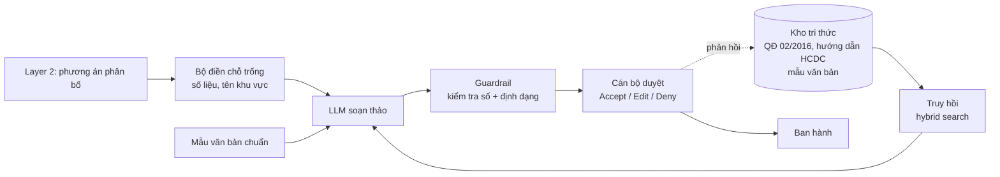

# 05 — Phương pháp GenAI RAG (Layer 3 — Soạn lệnh điều phối)

> Đây là lớp rủi ro cao nhất về mặt pháp lý: đầu ra là **văn bản chỉ đạo y tế công cộng**. Một con số sai trong văn bản điều phối nguy hiểm hơn nhiều so với một dự báo lệch.

---

## 1. Nguyên tắc thiết kế

1. **LLM không được phép sinh ra số.** Mọi con số trong văn bản (số ca dự báo, lượng vật tư, ngân sách, tên khu vực) đến từ đầu ra Layer 1/Layer 2 qua **điền chỗ trống (slot-filling)**, không phải do model tự viết. Đây là guardrail quan trọng nhất.
2. **Con người luôn duyệt cuối.** Không có đường nào để văn bản đi thẳng ra ngoài mà không qua nút duyệt. Đã cam kết trong đề án, và đây cũng là điều kiện để B2G chấp nhận.
3. **Mọi khẳng định phải truy nguồn được.** Câu nào viện dẫn quy định phải chỉ ra được văn bản gốc và điều khoản.
4. **Sai thì thà thiếu còn hơn thừa.** Không chắc thì để trống và đánh dấu `[CẦN BỔ SUNG]` cho cán bộ điền, tuyệt đối không bịa.

---

## 2. Kiến trúc



### Hai luồng tách biệt

| | **Luồng B2G** | **Luồng B2B** |
|---|---|---|
| Đầu ra | Dự thảo văn bản chỉ đạo hành chính | Cảnh báo vận hành nội bộ ngắn |
| Người nhận | CDC / Sở Y tế | Ban giám đốc / Trưởng khoa bệnh viện |
| Định dạng | Mẫu hành chính chuẩn, viện dẫn quy định | Tự do, súc tích, tập trung hành động |
| Mức kiểm soát | **Rất cao** — sai là vấn đề pháp lý | Trung bình |
| Cách sinh | Chủ yếu điền mẫu, LLM chỉ viết phần diễn giải | LLM sinh nhiều hơn |

**Thứ tự làm:** B2B trước (rủi ro thấp, ra giá trị nhanh), B2G sau (cần chuẩn bị kho tri thức kỹ hơn).

---

## 3. Kho tri thức

### 3.1 Nội dung

| Nhóm | Nguồn | Ghi chú |
|---|---|---|
| Quy định công bố dịch | Quyết định 02/2016/QĐ-TTg | Có trên Cổng TTĐT Chính phủ |
| Hướng dẫn giám sát, phòng chống SXH | Bộ Y tế, HCDC | Kiểm tra bản mới nhất, quy định y tế thay đổi thường xuyên |
| Mẫu văn bản hành chính | Nghị định về công tác văn thư | Thể thức trình bày văn bản |
| Hướng dẫn chuyên môn | Phác đồ điều trị, hướng dẫn xử lý ổ dịch | Minh Dương rà soát về mặt chuyên môn y sinh |

⚠️ **Rủi ro văn bản hết hiệu lực:** quy định y tế được sửa đổi/thay thế liên tục. Mỗi tài liệu trong kho phải có metadata `ngày ban hành`, `ngày hiệu lực`, `trạng thái (còn/hết hiệu lực)`, `văn bản thay thế`. Trích dẫn một quyết định đã bị thay thế trong văn bản chỉ đạo là lỗi nghiêm trọng.

### 3.2 Chỉ mục

- **Chunking:** cắt theo cấu trúc văn bản (Điều/Khoản/Mục), **không cắt theo số ký tự cố định** — văn bản pháp quy mất nghĩa khi cắt giữa điều khoản.
- **Kích thước chunk:** thử 3 mức (256 / 512 / 1024 token) và so sánh, xem §5.
- **Embedding:** thử ít nhất 2 model, ưu tiên model hỗ trợ tiếng Việt tốt. So sánh bằng bộ câu hỏi ở §5.
- **Lưu trữ:** pgvector trên Postgres chung ([README §3](../README.md#3-tech-stack-đã-chốt)).
- **Truy hồi lai (hybrid):** kết hợp vector search + BM25 từ khoá. Văn bản pháp quy nhiều thuật ngữ chính xác ("ổ dịch", "công bố dịch") mà tìm kiếm ngữ nghĩa thuần dễ trượt.

---

## 4. Guardrail — kiểm tra bắt buộc trước khi hiện cho cán bộ

Mọi văn bản sinh ra phải qua bộ kiểm tra tự động; **không pass thì không hiển thị**, báo lỗi để cán bộ soạn tay:

| # | Kiểm tra | Cách làm |
|---|---|---|
| G1 | **Không có số lạ** ⭐ | Trích toàn bộ số trong văn bản → đối chiếu với tập số hợp lệ từ Layer 1/2. Có số không khớp → chặn |
| G2 | **Tên khu vực hợp lệ** | Mọi địa danh phải nằm trong danh mục hành chính chuẩn |
| G3 | **Trích dẫn có thật** | Mọi văn bản được viện dẫn phải tồn tại trong kho tri thức và còn hiệu lực |
| G4 | **Đúng thể thức** | Có đủ các thành phần bắt buộc của văn bản hành chính |
| G5 | **Không khuyến cáo y khoa ngoài phạm vi** | Chặn nội dung chỉ định thuốc/liều lượng cụ thể. Cảnh báo cho dân chỉ được dùng nội dung từ danh mục đã duyệt sẵn (vd "không tự ý dùng Aspirin") |
| G6 | **Độ dài hợp lý** | Ngoài khoảng kỳ vọng → cờ để người xem kỹ |

**G1 là guardrail quan trọng nhất.** Cài đặt bằng regex trích số + so khớp tập hợp, không dùng LLM để tự kiểm tra chính nó.

---

## 5. Đánh giá

Không có cách nào "cảm thấy nó viết tốt" mà không đo. Cần bộ đánh giá thật.

### 5.1 Bộ vàng (golden set)

Xây **30–50 kịch bản** phủ các tình huống: dịch tăng mạnh / giảm / ổn định, một tỉnh / nhiều tỉnh, ngân sách đủ / thiếu, có / không có dữ liệu khuyết.

Mỗi kịch bản gồm: đầu vào (kết quả Layer 1+2) → văn bản tham chiếu do **Minh Dương soạn và rà soát chuyên môn**.

### 5.2 Đánh giá truy hồi

Trước khi đánh giá chất lượng sinh, phải chắc chắn khâu tìm kiếm đúng — sinh kém thường do truy hồi sai chứ không phải LLM kém.

| Metric | Nội dung |
|---|---|
| **Recall@k** (k=3,5,10) | Đoạn văn bản đúng có nằm trong top-k không? |
| **MRR** | Đoạn đúng xếp hạng bao nhiêu? |
| **Tỉ lệ nhiễu** | Bao nhiêu % đoạn truy hồi không liên quan? |

So sánh: kích thước chunk × model embedding × có/không hybrid search → chọn cấu hình tốt nhất.

### 5.3 Đánh giá sinh văn bản

| Chiều | Cách đo | Ngưỡng |
|---|---|---|
| **Tính trung thực (faithfulness)** ⭐ | Mọi khẳng định truy được về đoạn đã truy hồi hoặc số từ Layer 1/2 | **100%** — không thương lượng |
| **Chính xác số liệu** | G1 pass | **100%** |
| **Tuân thủ thể thức** | Đối chiếu mẫu chuẩn | ≥ 95% |
| **Đầy đủ** | Có đủ các mục bắt buộc | ≥ 95% |
| **Hữu dụng** | Cán bộ chấm 1–5: cần sửa nhiều hay ít? | ≥ 4.0 |
| **Tỉ lệ chỉnh sửa** | % văn bản bị cán bộ sửa trước khi duyệt | Theo dõi xu hướng giảm dần |

**Cách chấm:** LLM-as-judge với rubric rõ ràng cho vòng lặp nhanh, **cộng với** người rà soát ngẫu nhiên ≥20% mẫu. Không tin tuyệt đối vào LLM-judge, đặc biệt ở chiều "tính trung thực".

### 5.4 So sánh cấu hình

Như các layer khác — so sánh có kỷ luật, không chọn theo cảm giác:

| Chiều so sánh | Phương án |
|---|---|
| **LLM** | Claude vs GPT vs model mở (Qwen/Llama tiếng Việt) — cân nhắc cả chi phí/1000 văn bản |
| **Chiến lược prompt** | Zero-shot vs few-shot vs chain-of-thought vs điền mẫu thuần |
| **Nhiệt độ** | 0 (ổn định, khuyến nghị cho văn bản hành chính) vs 0.3 |
| **Có/không RAG** | Chứng minh RAG thực sự cải thiện, không chỉ là thêm phức tạp |

### 5.5 Chỉ số quan trọng nhất khi vận hành

> **Tỉ lệ chấp nhận không sửa** — % văn bản cán bộ bấm Accept mà không chỉnh sửa gì.

Đây là thước đo giá trị thật của Layer 3, đúng bằng ngôn ngữ của luận điểm bán hàng ("tiết kiệm phần lớn thời gian soạn thảo"). Theo dõi ngay từ pilot đầu tiên.

---

## 6. Vòng phản hồi

Mỗi lần cán bộ sửa văn bản trước khi duyệt là một mẫu huấn luyện miễn phí:

```
Lưu lại: (đầu vào, văn bản AI sinh, văn bản sau khi cán bộ sửa, lý do sửa)
    → Phân tích định kỳ: sửa nhiều nhất ở chỗ nào?
    → Cải thiện: bổ sung mẫu few-shot / sửa prompt / bổ sung kho tri thức
```

Đây chính là **rào cản cải tiến liên tục** đã nêu trong đề án — nhưng chỉ thành hiện thực nếu hệ thống **lưu dữ liệu sửa đổi ngay từ pilot đầu tiên**. Bỏ qua ở giai đoạn đầu là mất vĩnh viễn dữ liệu đó.

---

## 7. Cổng quyết định Layer 3

| # | Điều kiện | Ngưỡng |
|---|---|---|
| R1 | Tính trung thực | 100% trên bộ vàng |
| R2 | Guardrail G1 (số liệu) | 100%, không ngoại lệ |
| R3 | Truy hồi | Recall@5 ≥ 0.90 trên bộ câu hỏi |
| R4 | Thể thức | ≥ 95% |
| R5 | Rà soát chuyên môn | Minh Dương duyệt toàn bộ bộ vàng |
| R6 | Không có đường vòng | Kiểm chứng bằng code: không tồn tại đường nào ban hành mà không qua duyệt |
| R7 | Ghi nhật ký | Mọi lần sinh văn bản được log đủ để truy vết |
