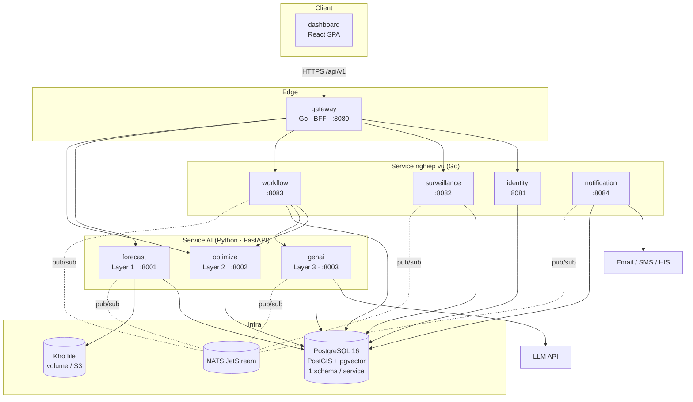
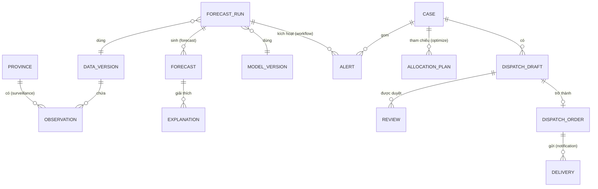
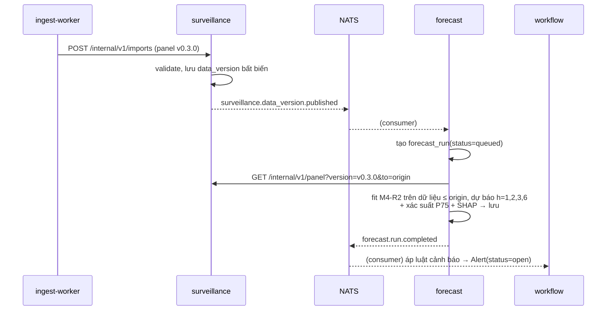
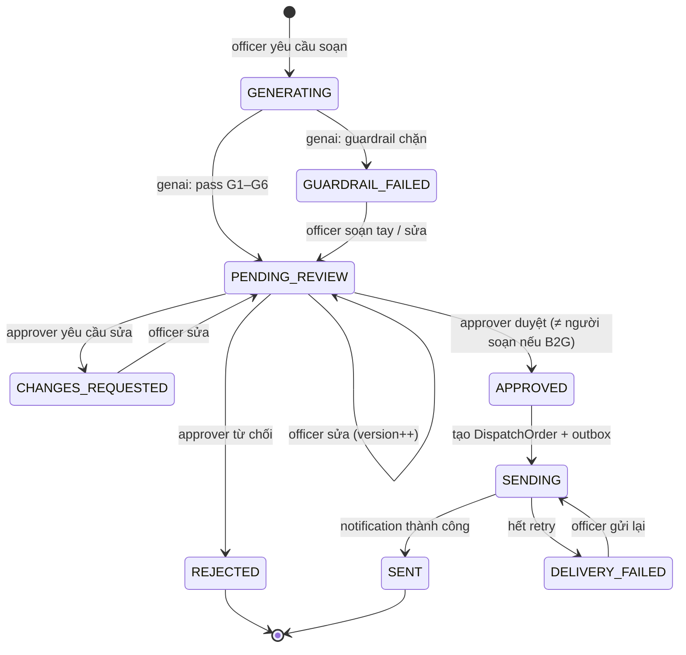

# 09 — Kiến trúc hệ thống & Backend (microservice)

> **Trạng thái:** v1.0 — bản chốt để bắt đầu code (2026-09-25). Mọi thay đổi quyết định trong tài liệu này phải đi qua ADR (§17.2).
> **Ai đọc:** 🔧 Nam Hải (chủ trì backend, infra) · 🧬 Minh Dương (chủ trì 3 service Python) · ai viết frontend (đọc §3–§8 trước khi đọc [10-kien-truc-frontend.md](10-kien-truc-frontend.md)).
> **Đọc kèm:** [07-model-card.md](07-model-card.md) (mô hình được phép và không được phép dùng thế nào), [04](04-phuong-phap-toi-uu.md) (Layer 2), [05](05-phuong-phap-genai-rag.md) (Layer 3), [../CONTRIBUTING.md](../CONTRIBUTING.md) (git).

Tài liệu này chốt **cách hệ thống được chia service, giao tiếp, lưu dữ liệu, bảo mật, kiểm thử, triển khai và quy trình làm việc** trước khi viết dòng code backend đầu tiên. Phần nào ghi **PHẢI** là luật (CI hoặc review sẽ chặn); **NÊN** là khuyến nghị mạnh, lệch thì ghi lý do trong PR.

---

## Mục lục

1. [Bối cảnh & ràng buộc thật](#1-bối-cảnh--ràng-buộc-thật)
2. [Mười nguyên tắc kiến trúc](#2-mười-nguyên-tắc-kiến-trúc)
3. [Kiến trúc tổng thể](#3-kiến-trúc-tổng-thể)
4. [Danh mục service](#4-danh-mục-service)
5. [Mô hình miền (domain model)](#5-mô-hình-miền-domain-model)
6. [Giao tiếp đồng bộ — quy tắc REST API](#6-giao-tiếp-đồng-bộ--quy-tắc-rest-api)
7. [Giao tiếp bất đồng bộ — sự kiện](#7-giao-tiếp-bất-đồng-bộ--sự-kiện)
8. [Các luồng nghiệp vụ chính](#8-các-luồng-nghiệp-vụ-chính)
9. [Dữ liệu & lưu trữ](#9-dữ-liệu--lưu-trữ)
10. [Phục vụ mô hình (ML serving) — luật riêng](#10-phục-vụ-mô-hình-ml-serving--luật-riêng)
11. [Bảo mật](#11-bảo-mật)
12. [Độ tin cậy & xử lý lỗi](#12-độ-tin-cậy--xử-lý-lỗi)
13. [Quan sát hệ thống (observability)](#13-quan-sát-hệ-thống-observability)
14. [Cấu trúc code từng service](#14-cấu-trúc-code-từng-service)
15. [Kiểm thử](#15-kiểm-thử)
16. [Cấu hình, môi trường, CI/CD, triển khai](#16-cấu-hình-môi-trường-cicd-triển-khai)
17. [Quy trình làm việc](#17-quy-trình-làm-việc)
18. [Kế hoạch triển khai theo đợt](#18-kế-hoạch-triển-khai-theo-đợt)
19. [Quyết định còn mở](#19-quyết-định-còn-mở)

---

## 1. Bối cảnh & ràng buộc thật

Kiến trúc phải khớp với thực tế, không phải với sách giáo khoa. Các ràng buộc sau **quyết định thiết kế**:

| # | Ràng buộc | Hệ quả thiết kế |
|---|---|---|
| R1 | Đội tech **2 người**, thời gian hạn chế | Ít service nhất có thể mà vẫn giữ ranh giới rõ; dùng chung tooling (1 Go module, 1 Python package); không Kubernetes, không service mesh |
| R2 | Dữ liệu dịch tễ **theo tháng**, cập nhật **theo đợt** | Dự báo **tính trước theo lô (batch)** và lưu lại; API chỉ **đọc kết quả đã tính**, không chạy model theo từng request |
| R3 | Dữ liệu ca bệnh **thật cấp tỉnh chỉ tới 2010**; 2011–2025 là **ước lượng** (docs/01 §2.1c) | Hệ thống phải có **chế độ tái hiện lịch sử (backtest replay)** là chế độ demo chính; mọi con số phải mang nhãn nguồn `real/estimated` |
| R4 | Model card §2: **không dùng cho quyết định tự động**, không dùng cấp huyện/xã | Không có API nào trả dự báo cấp dưới tỉnh; mọi hành động ra ngoài (dispatch) **bắt buộc qua người duyệt** |
| R5 | Model card §11–12: bias bùng dịch, Nam ≈ B3, base rate đổi theo năm | API **bắt buộc** trả kèm base rate, độ tin cậy theo vùng, cờ cảnh báo (xem §10) |
| R6 | Layer 3 dùng LLM bên ngoài: **LLM không được sinh số** (docs/05 §1) | Service GenAI tách riêng, có guardrail G1–G6; khoá API LLM chỉ nằm ở service đó |
| R7 | Pilot: **1 VM**, Docker Compose, 2 tỉnh | Mọi service chạy được trên 1 máy 4 vCPU / 16 GB; triển khai bằng compose |
| R8 | Đã chốt stack: Go (Gin) + Python (FastAPI) + React + Postgres/PostGIS/pgvector | Giữ nguyên; thêm **NATS JetStream** cho sự kiện (ADR-003, §7) |

**Tại sao vẫn chọn microservice khi đội nhỏ?** Vì hệ thống có 3 lý do tách thật sự, không phải tách cho đẹp:
1. **Hai runtime khác nhau** (Go cho nghiệp vụ, Python cho ML/tối ưu/LLM) — buộc phải là tiến trình riêng.
2. **Hồ sơ rủi ro khác nhau**: service giữ khoá LLM và gửi văn bản ra ngoài cần cô lập khỏi service xác thực người dùng; job dự báo nặng (phút, nhiều RAM) không được làm chậm API đọc.
3. **Nhịp thay đổi khác nhau**: model đổi theo thí nghiệm (Minh Dương), nghiệp vụ duyệt lệnh đổi theo yêu cầu CDC (Nam Hải) — tách ra để hai người không giẫm chân nhau.

Chi phí của microservice (vận hành, gỡ lỗi phân tán, nhất quán dữ liệu) được kiểm soát bằng: **chung repo, chung tooling, chung 1 cụm Postgres (tách schema), triển khai theo đợt (§18)**.

---

## 2. Mười nguyên tắc kiến trúc

1. **Mỗi service sở hữu dữ liệu của mình.** Không service nào đọc/ghi schema của service khác. Cần dữ liệu thì gọi API hoặc nghe sự kiện.
2. **Hợp đồng trước, code sau (contract-first).** OpenAPI / JSON Schema trong `contracts/` là nguồn sự thật; code phải khớp hợp đồng, CI kiểm (§6.10).
3. **Một cửa ra vào.** Frontend chỉ nói chuyện với `gateway`. Service nội bộ không mở cổng ra Internet.
4. **Đọc nhanh, tính trước.** Mọi thứ nặng (dự báo, tối ưu lớn, sinh văn bản) chạy dạng job; API đọc trả kết quả đã lưu (p95 < 300 ms).
5. **Mọi con số có nguồn gốc (provenance).** Số trả ra phải kèm `model_version`, `data_version`, `run_id`, `as_of`, `data_source`. Không có provenance = không được trả.
6. **Con người duyệt cuối.** Không có đường code nào đưa văn bản/lệnh ra khỏi hệ thống mà không có bản ghi duyệt hợp lệ (§8.4). Đây là bất biến, có test riêng.
7. **Thất bại có kiểm soát.** Mỗi lời gọi mạng có timeout; hệ thống xuống cấp dần (hiện dữ liệu cũ kèm cảnh báo) thay vì sập (§12).
8. **Sự kiện là sự thật đã xảy ra.** Sự kiện đặt tên thì quá khứ, bất biến, có phiên bản schema, phát qua outbox (không mất, không phát ma).
9. **Không tin mạng nội bộ.** Service-to-service vẫn xác thực bằng token dịch vụ; mọi đầu vào vẫn được validate.
10. **Đơn giản trước, mở rộng khi có số đo.** Không thêm cache, queue, replica… khi chưa có số đo chứng minh cần.

---

## 3. Kiến trúc tổng thể

### 3.1 Sơ đồ container



### 3.2 Hai kiểu giao tiếp

| Kiểu | Dùng khi | Công nghệ |
|---|---|---|
| **Đồng bộ (REST/JSON)** | Truy vấn cần câu trả lời ngay: đọc dự báo, tạo phương án, duyệt lệnh | HTTP/1.1 JSON, OpenAPI 3.1 |
| **Bất đồng bộ (sự kiện)** | Thông báo "đã xảy ra": có dữ liệu mới → chạy dự báo; dự báo xong → sinh cảnh báo; lệnh đã duyệt → gửi | NATS JetStream, CloudEvents 1.0 |

**Không dùng gRPC ở MVP** (ADR-004): tất cả service đều nói JSON được, gỡ lỗi bằng curl, 1 loại hợp đồng duy nhất (OpenAPI). Xem lại khi có số đo độ trễ nội bộ là vấn đề.

### 3.3 Ranh giới tin cậy

```
Internet ──HTTPS──► [reverse proxy TLS: Caddy] ──► gateway ──(mạng docker nội bộ "core")──► các service
                                                          └── chỉ gateway có cổng publish ra host
```

- Chỉ `caddy` (TLS, :443) publish ra ngoài; `gateway` chỉ nhận từ caddy.
- Service nội bộ nằm trong network `core`; `genai` và `notification` là 2 service **duy nhất** có quyền đi ra Internet (egress) — các service khác bị chặn egress ở mức docker network (NÊN, khi pilot).

---

## 4. Danh mục service

### 4.1 Bảng tổng

| Service | Ngôn ngữ | Bounded context — chịu trách nhiệm | Sở hữu dữ liệu (schema) | Owner | Đợt |
|---|---|---|---|---|---|
| `gateway` | Go | Cửa vào duy nhất; xác minh JWT; RBAC thô; rate limit; CORS; ghép dữ liệu cho màn hình (BFF) | — (không có DB) | 🔧 | 1 |
| `identity` | Go | Người dùng, vai trò, đơn vị (tỉnh/bệnh viện), đăng nhập, cấp/thu hồi token, nhật ký kiểm toán tập trung | `identity` | 🔧 | 1 |
| `surveillance` | Go | Danh mục 34 tỉnh + GeoJSON; chuỗi quan sát ca bệnh/khí hậu/dân số; **phiên bản dữ liệu** (data version); nhập dữ liệu | `surveillance` | 🔧 | 1 |
| `forecast` | Python | Layer 1: chạy dự báo theo lô (M4-R2), xác suất cảnh báo P75, giải thích SHAP, model card; lưu kết quả | `forecast` + kho file | 🧬 | 1 |
| `optimize` | Python | Layer 2: phương án phân bổ (P1/P2), phân tích cận biên, giá bóng | `optimize` | 🧬 | 2 |
| `workflow` | Go | Vòng đời cảnh báo → phương án → dự thảo → **duyệt** → lệnh; máy trạng thái; quy tắc 4 mắt | `workflow` | 🔧 | 2 |
| `genai` | Python | Layer 3: RAG, soạn dự thảo, guardrail G1–G6; kho tri thức (pgvector) | `genai` | 🧬 | 3 |
| `notification` | Go | Gửi ra ngoài (email/SMS/HIS) qua adapter; theo dõi trạng thái giao; retry | `notification` | 🔧 | 3 |

Thêm 1 tiến trình phụ trợ, **không phải service có API**:

| Tiến trình | Ngôn ngữ | Việc |
|---|---|---|
| `ingest-worker` | Python | Job định kỳ kéo ERA5/ONI/nguồn ca bệnh (code đã có ở `ai-service/app/data/`), dựng panel, đẩy vào `surveillance` qua API nhập dữ liệu. Chạy theo lịch (cron trong container), không nhận request. |

### 4.2 Mô tả chi tiết từng service

**`gateway` (BFF)**
- Làm: định tuyến `/api/v1/*` tới service; xác minh chữ ký JWT (khoá công khai của `identity`, cache JWKS); kiểm quyền thô theo route (bảng §11.3); gắn `X-Request-ID`/`traceparent`; rate limit theo IP và theo user; **ghép** các endpoint màn hình (vd `/risk-map` = danh mục tỉnh từ `surveillance` + dự báo từ `forecast` + cảnh báo đang mở từ `workflow`).
- KHÔNG làm: logic nghiệp vụ, ghi DB, quyết định quyền chi tiết theo dữ liệu (việc của service đích).
- Quy tắc ghép: tối đa 3 lời gọi song song, timeout tổng 2 s; một nguồn phụ lỗi → trả phần còn lại + `warnings[]` (không 500 cả trang).

**`identity`**
- Người dùng, vai trò (§11.3), đơn vị trực thuộc (`org_id`: CDC tỉnh X, bệnh viện Y) → quyết định phạm vi dữ liệu được thấy/duyệt.
- Cấp access token (JWT, 15 phút) + refresh token (xoay vòng, 7 ngày, lưu hash); đăng xuất = thu hồi refresh; khoá sau 5 lần sai.
- Lưu **nhật ký kiểm toán** (append-only) nhận qua sự kiện `*.audit` từ mọi service — một chỗ để tra "ai làm gì lúc nào".

**`surveillance`**
- Danh mục tỉnh (34 tỉnh mới, mã `new_province_code`, vùng, dân số) và ranh giới GeoJSON **có phiên bản**.
- Chuỗi quan sát theo tháng: `cases`, `incidence_per_100k`, khí hậu, `data_source ∈ {real, estimated, imputed, simulated}`.
- `data_version` (vd `v0.2.0`): mỗi lần nhập là một phiên bản bất biến; phát `surveillance.data_version.published`.
- Nguồn nhập: `ingest-worker` (file panel đã dựng) và sau này cán bộ nhập báo cáo tay (form) — mọi dòng nhập tay mang `data_source=real`, `entered_by`.

**`forecast`** (Layer 1 — tái dùng thư viện `ai-service/app/forecast/`)
- Chạy **forecast run**: với 1 `origin` (tháng neo) + `data_version` + `model_version` → dự báo số ca cho h ∈ {1,2,3,6}, xác suất vượt ngưỡng P75, ngưỡng, base rate, giải thích SHAP top-k.
- Hai chế độ run: `backtest` (origin trong quá khứ có dữ liệu thật — chế độ demo chính) và `live_experimental` (origin gần hiện tại, đầu vào có dữ liệu ước lượng — luôn gắn cờ).
- Phát `forecast.run.completed`; phục vụ API đọc kết quả + model card + danh sách giới hạn (§10).

**`optimize`** (Layer 2): nhận `run_id` + ngân sách + ràng buộc → phương án phân bổ kèm giải thích (xếp hạng, ngưỡng cắt, cận biên, giá bóng, lý do loại — docs/04 §6). Job ngắn (< 30 s) chạy đồng bộ; job lớn chạy nền, trả `202 + Location`.

**`workflow`** — trái tim của human-in-the-loop:
- Thực thể: `Alert` (sinh từ `forecast.run.completed` theo luật cảnh báo), `Case` (một hồ sơ xử lý gom cảnh báo + phương án + dự thảo), `DispatchDraft`, `Review`, `DispatchOrder`.
- Máy trạng thái §8.4; quy tắc 4 mắt: người tạo yêu cầu soạn **không** được tự duyệt văn bản B2G.
- Gọi `optimize`, `genai` đồng bộ (có timeout) hoặc qua job; khi lệnh được duyệt phát `workflow.order.approved`.

**`genai`** (Layer 3): nhận slot số liệu (từ Layer 1/2, do `workflow` gửi) + loại văn bản (B2B/B2G) → dự thảo + kết quả guardrail G1–G6 + trích dẫn. Không bao giờ tự gửi đi đâu. Khoá LLM chỉ nằm ở đây.

**`notification`**: nghe `workflow.order.approved` → gửi qua kênh (email trước; SMS/HIS là adapter sau) → phát `notification.delivery.succeeded|failed`. Idempotent theo `order_id + channel + recipient`.

### 4.3 Service KHÔNG tách (và lý do)

| Không tách | Lý do |
|---|---|
| Auth riêng khỏi user | Quá nhỏ; `identity` gồm cả hai |
| Audit service riêng | Gộp vào `identity` (ghi append-only); tách khi khối lượng lớn |
| Map/tile service | Dùng tile công khai + GeoJSON tĩnh có phiên bản từ `surveillance` |
| Micro-frontend | 1 SPA là đủ cho 1 đội (xem doc 10) |
| API gateway thương mại (Kong…) | Gateway Go tự viết ~ vài trăm dòng + cần làm BFF nên tự viết rẻ hơn |

---

## 5. Mô hình miền (domain model)

### 5.1 Thực thể chính và service sở hữu



Tham chiếu chéo service **chỉ bằng ID** (vd `workflow.alert.run_id` là UUID của `forecast`), không có khoá ngoại xuyên schema.

### 5.2 Từ điển thuật ngữ (dùng thống nhất trong code, API, UI)

| Thuật ngữ | Định nghĩa | Tên trong code |
|---|---|---|
| Tháng neo (origin) | Tháng cuối cùng có dữ liệu dùng để dự báo | `origin_month` |
| Tầm dự báo (horizon) | Số tháng tính từ origin: 1, 2, 3, 6 | `horizon` |
| Tháng đích | `origin + horizon` | `target_month` |
| Độ trễ báo cáo D | Dữ liệu tháng t có sau D=1 tháng | `reporting_delay_months` |
| Ngưỡng P75 | Phân vị 75 lịch sử cùng tháng dương lịch, cùng tỉnh, tính nhân quả | `threshold_p75` |
| Base rate | Tỉ lệ nền tháng vượt ngưỡng trong giai đoạn tham chiếu | `base_rate` |
| Phiên bản dữ liệu | Snapshot bất biến của panel | `data_version` (semver) |
| Phiên bản mô hình | Cấu hình model đã khoá (vd `m4-r2@1.0.0`) | `model_version` |
| Lượt dự báo | 1 lần chạy cho 1 origin | `forecast_run` / `run_id` |
| Nguồn dữ liệu | `real` · `estimated` · `imputed` · `simulated` | `data_source` |

### 5.3 Quy ước định danh & thời gian

- ID thực thể: **UUIDv7** (sắp theo thời gian, sinh ở service). Tỉnh dùng mã nghiệp vụ `province_id` (mã tỉnh mới, chuỗi) — không dùng UUID.
- Tháng: kiểu `DATE` = ngày 1 của tháng trong DB; trong JSON là chuỗi `"YYYY-MM"`.
- Thời điểm: `timestamptz` lưu UTC; JSON dạng RFC 3339 có `Z`; **hiển thị** theo `Asia/Ho_Chi_Minh` ở frontend.
- Số ca: số thực không âm (dự báo) hoặc nguyên (quan sát); tỉ lệ `incidence_per_100k`; xác suất ∈ [0,1] (không dùng %).

---

## 6. Giao tiếp đồng bộ — quy tắc REST API

### 6.1 Đường dẫn & phiên bản

- Công khai (qua gateway): `https://<host>/api/v1/...`
- Nội bộ (service ↔ service): `http://<service>:<port>/internal/v1/...` — gateway **không** định tuyến `/internal`.
- Tài nguyên dùng **danh từ số nhiều, kebab-case**: `/forecast-runs`, `/dispatch-drafts/{draft_id}`.
- Hành động không phải CRUD: sub-resource động từ, `POST`: `/dispatch-drafts/{id}/reviews`, `/forecast-runs/{id}/cancel`.
- Trường JSON: **snake_case** (khớp Python và DB; frontend dùng đúng tên, không map sang camelCase).

### 6.2 Phương thức & mã trạng thái

| Tình huống | Mã |
|---|---|
| Đọc OK | 200 |
| Tạo xong đồng bộ | 201 + header `Location` |
| Nhận job chạy nền | 202 + `Location: /api/v1/jobs/{id}` |
| Xoá / hành động không trả thân | 204 |
| Sai định dạng / validate | 400 (`validation_error`) |
| Chưa xác thực | 401 · Không đủ quyền | 403 |
| Không có | 404 · Xung đột trạng thái (vd duyệt bản đã duyệt) | 409 |
| Sai điều kiện phiên bản (`If-Match`) | 412 · Quá nhiều request | 429 |
| Lỗi nội bộ | 500 · Phụ thuộc hỏng | 502/503 · Hết thời gian phụ thuộc | 504 |

### 6.3 Định dạng lỗi — RFC 9457 `application/problem+json` (PHẢI)

```json
{
  "type": "https://denguesense.vn/errors/invalid-state-transition",
  "title": "Không thể chuyển trạng thái",
  "status": 409,
  "code": "workflow.invalid_state_transition",
  "detail": "Dự thảo đang ở trạng thái APPROVED, không thể duyệt lại.",
  "instance": "/api/v1/dispatch-drafts/0192.../reviews",
  "request_id": "01J9Z...",
  "errors": [{ "field": "action", "message": "..." }]
}
```

- `code` dạng `<service>.<snake_case>`, **ổn định** (frontend dựa vào `code`, không dựa vào `detail`). Danh mục mã nằm trong `contracts/errors.md`.
- Không bao giờ trả stack trace, câu SQL, tên bảng ra ngoài.

### 6.4 Phân trang, lọc, sắp xếp

- Danh sách **luôn** phân trang bằng con trỏ: `?limit=50&cursor=<opaque>` → `{ "items": [...], "next_cursor": "..." | null }`. `limit` tối đa 200.
- **Ngoại lệ duy nhất:** *danh mục đóng, nhỏ, có giới hạn cứng* (34 tỉnh, phiên bản dữ liệu, phiên bản mô hình, danh sách giới hạn) trả đủ `{ "items": [...] }` không phân trang. Hợp đồng ghi rõ "danh mục đóng" ở `summary`; thêm ngoại lệ mới cần lý do trong PR hợp đồng.
- Lọc bằng tham số tên trường: `?province_id=HN&region=Bắc&from=2009-11&to=2010-06`.
- Sắp xếp: `?sort=-created_at` (dấu `-` = giảm dần); chỉ trên trường có index, danh sách trường cho phép ghi trong OpenAPI.

### 6.5 Provenance trong mọi response chứa số liệu (PHẢI)

```json
{
  "meta": {
    "run_id": "0192f3...",
    "run_mode": "backtest",
    "model_version": "m4-r2@1.0.0",
    "data_version": "v0.2.0",
    "origin_month": "2010-03",
    "as_of": "2026-09-25T02:00:00Z",
    "generated_at": "2026-09-25T02:14:09Z",
    "limitations_ref": "/api/v1/model-card#limitations"
  },
  "items": [ ... ]
}
```

### 6.6 Idempotency & đồng thời

- Mọi `POST` tạo tài nguyên hoặc kích hoạt tác dụng phụ **PHẢI** nhận header `Idempotency-Key` (UUID do client sinh). Service lưu `(key, user_id) → response` 24 h; gửi lại cùng key → trả lại đúng response cũ.
- Cập nhật tài nguyên có thể bị sửa đồng thời (dự thảo, phương án) dùng **ETag + `If-Match`** (khoá lạc quan theo cột `version`). Thiếu `If-Match` → 428.

### 6.7 Validate đầu vào

- Go: validate ở handler (struct tag + kiểm tra nghiệp vụ ở tầng app); Python: Pydantic v2 với `extra="forbid"`.
- Giới hạn kích thước body 1 MB (trừ endpoint nhập dữ liệu: 50 MB, chỉ role `data_manager`).
- Chuỗi tự do (ghi chú duyệt, sửa dự thảo) giới hạn độ dài và lưu nguyên văn; **escape khi hiển thị**, không sanitize khi lưu.

### 6.8 Timeout, header chuẩn

| Header | Ý nghĩa |
|---|---|
| `X-Request-ID` | Gateway sinh nếu thiếu; truyền qua mọi lời gọi & log |
| `traceparent` | W3C Trace Context (OpenTelemetry) |
| `Authorization: Bearer` | JWT người dùng (công khai) hoặc token dịch vụ (nội bộ) |
| `X-Actor-ID`, `X-Actor-Roles`, `X-Org-ID` | Gateway gắn sau khi xác minh JWT, service nội bộ **chỉ tin** khi đi kèm token dịch vụ hợp lệ |

### 6.9 Danh sách endpoint công khai v1 (khung — chi tiết trong OpenAPI)

| Nhóm | Endpoint | Service đích | Quyền tối thiểu |
|---|---|---|---|
| Auth | `POST /auth/login` · `POST /auth/refresh` · `POST /auth/logout` · `GET /me` | identity | công khai / đã đăng nhập |
| Danh mục | `GET /provinces` · `GET /provinces/{province_id}` · `GET /geo/provinces?version=` | surveillance | viewer |
| Quan sát | `GET /observations?province_id&from&to` · `GET /data-versions` | surveillance | viewer |
| Dự báo | `GET /forecast-runs?mode&status` · `GET /forecast-runs/{run_id}` · `POST /forecast-runs` | forecast | viewer / **analyst** (tạo) |
| Màn hình | `GET /risk-map?run_id&horizon` (BFF ghép) | gateway | viewer |
| Dự báo tỉnh | `GET /provinces/{id}/forecasts?run_id` · `GET /provinces/{id}/explanations?run_id&horizon` | forecast | viewer |
| Mô hình | `GET /model-card` · `GET /model-card/limitations` · `GET /model-versions` | forecast | viewer |
| Cảnh báo | `GET /alerts?status&region&run_id` · `POST /alerts/{id}/acknowledgements` | workflow | officer |
| Hồ sơ | `POST /cases` · `GET /cases/{id}` · `GET /cases?status` | workflow | officer |
| Phân bổ | `POST /cases/{id}/allocation-plans` · `GET /allocation-plans/{id}` | workflow → optimize | officer |
| Dự thảo | `POST /cases/{id}/dispatch-drafts` · `GET /dispatch-drafts/{id}` · `PATCH /dispatch-drafts/{id}` (sửa, If-Match) | workflow → genai | officer |
| Duyệt | `POST /dispatch-drafts/{id}/reviews` (`approve`/`reject`/`request_changes`) | workflow | **approver** |
| Lệnh | `GET /dispatch-orders/{id}` (gồm trạng thái giao) | workflow + notification | officer |
| Job | `GET /jobs/{job_id}` | gateway → service chủ job | người tạo job |
| Quản trị | `GET/POST /admin/users` · `GET /admin/audit-events` | identity | admin |
| Sức khoẻ | `GET /healthz` · `GET /readyz` | mọi service | nội bộ |

### 6.10 Hợp đồng là nguồn sự thật — cách giữ đồng bộ

```
contracts/
├── openapi/
│   ├── public-v1.yaml               # API gateway công khai (frontend đọc file này)
│   ├── identity-internal.yaml       # ✅ Đợt 1
│   ├── surveillance-internal.yaml   # ✅ Đợt 1
│   ├── forecast-internal.yaml       # ✅ Đợt 1
│   └── optimize|workflow|genai-internal.yaml   # thêm ở Đợt 2–3
├── routing.yaml                     # bản đồ gateway: operation công khai → lời gọi nội bộ + vai trò tối thiểu
├── events/                          # JSON Schema cho từng sự kiện, có version
└── errors.md                        # danh mục mã lỗi
```

Schema dùng chung giữa các file là **bản sao có chủ đích** (không $ref chéo file); test `test_internal_contracts.py` bảo đảm bản sao
trùng tên thì giống hệt. `routing.yaml` được test đối chiếu: phủ đúng các operation công khai, mọi upstream trỏ tới operation nội bộ có thật.

- **Go**: sinh interface server + kiểu dữ liệu bằng `oapi-codegen` từ file hợp đồng → code không khớp thì không biên dịch được.
- **Python**: viết Pydantic/FastAPI, CI xuất `/openapi.json` rồi so với file hợp đồng bằng `oasdiff` — lệch là fail.
- **Frontend**: sinh type bằng `openapi-typescript` từ `public-v1.yaml`.
- **Phá vỡ tương thích** (xoá/đổi tên trường, đổi kiểu, thêm trường bắt buộc ở request) → `oasdiff breaking` fail CI → phải: (a) thêm trường mới song song, đánh dấu `deprecated: true` trường cũ, giữ ≥ 1 đợt phát hành; hoặc (b) tăng lên `/v2`. Thêm trường **tuỳ chọn** vào response là không phá vỡ; client **PHẢI** bỏ qua trường lạ.

---

## 7. Giao tiếp bất đồng bộ — sự kiện

### 7.1 Tại sao NATS JetStream (ADR-003)

README gốc định "Redis chỉ thêm khi pilot". Bài toán cần: bền (không mất sự kiện khi service chết), phát lại, consumer group. NATS JetStream đáp ứng đủ, là **1 binary ~20 MB, RAM thấp**, không cần Zookeeper/Kafka. Redis Streams cũng được nhưng phải tự quản nhiều hơn. Quyết định: NATS JetStream; Redis vẫn chỉ thêm khi có số đo cần cache.

### 7.2 Phong bì sự kiện — CloudEvents 1.0 (JSON)

```json
{
  "specversion": "1.0",
  "id": "0192f4a1-...",
  "source": "denguesense/forecast",
  "type": "forecast.run.completed",
  "dataschema": "contracts/events/forecast.run.completed.v1.json",
  "time": "2026-09-25T02:14:09Z",
  "subject": "run/0192f3...",
  "traceparent": "00-...",
  "data": { "run_id": "0192f3...", "run_mode": "backtest", "origin_month": "2010-03",
            "model_version": "m4-r2@1.0.0", "data_version": "v0.2.0",
            "provinces": 34, "horizons": [1,2,3,6] }
}
```

- Tên `type`: `<service>.<thực_thể>.<động_từ_quá_khứ>`. Subject NATS = `type`.
- `data` **chỉ chứa ID và tóm tắt**, không nhét toàn bộ dự báo (bên nhận gọi API nếu cần) — tránh sự kiện phình và lệch dữ liệu.
- Đổi schema phá vỡ → tạo `...v2.json`, phát song song cả v1 và v2 tới khi hết consumer v1.

### 7.3 Danh mục sự kiện (v1)

| Sự kiện | Phát bởi | Nghe bởi | Tác dụng |
|---|---|---|---|
| `surveillance.data_version.published` | surveillance | forecast | Lên lịch forecast run mới (chế độ live_experimental) |
| `forecast.run.completed` | forecast | workflow, gateway (xoá cache nếu có) | workflow áp luật cảnh báo → tạo `Alert` |
| `forecast.run.failed` | forecast | workflow (hiện trạng thái cho analyst) | — |
| `workflow.alert.raised` | workflow | notification (thông báo nội bộ cho officer) | — |
| `workflow.draft.review_requested` | workflow | notification (báo approver) | — |
| `workflow.order.approved` | workflow | notification | Gửi ra ngoài |
| `notification.delivery.succeeded` / `.failed` | notification | workflow | Cập nhật trạng thái lệnh |
| `*.audit.recorded` | mọi service | identity | Ghi nhật ký kiểm toán |

### 7.4 Đảm bảo giao nhận (PHẢI)

- **Transactional outbox**: ghi thay đổi nghiệp vụ và bản ghi sự kiện vào bảng `outbox` **trong cùng transaction**; 1 goroutine/tác vụ nền đọc `outbox` chưa gửi → publish → đánh dấu đã gửi. Không bao giờ `publish` trực tiếp trong handler.
- Giao **ít nhất một lần** → consumer **PHẢI idempotent**: bảng `inbox(event_id PRIMARY KEY)`; nhận trùng thì bỏ qua.
- Consumer lỗi: retry backoff lũy thừa (1 s, 5 s, 30 s, 2 m, 10 m), quá 5 lần → chuyển sang stream `DLQ.<type>` + log `error` + cảnh báo. Có lệnh CLI phát lại từ DLQ.
- Không dựa vào thứ tự toàn cục; nếu cần thứ tự theo thực thể thì kiểm `version` trong `data`.

---

## 8. Các luồng nghiệp vụ chính

### 8.1 Lượt dự báo hằng tháng (và tái hiện lịch sử)



- Chế độ `backtest`: analyst gọi `POST /forecast-runs {mode: "backtest", origin_month: "2010-03"}`. **Cùng code path** với live, chỉ khác origin — không có đường tắt "nạp số từ file kết quả" trừ job nhập có dấu `source_experiment=exp_016` (để demo nhanh, gắn nhãn rõ).
- Một run cho 34 tỉnh × 4 horizon là job **phút**, chạy trong process worker của `forecast` (hàng đợi nội bộ, 1 run cùng lúc — tránh tràn RAM).

### 8.2 Xem bản đồ rủi ro

`GET /api/v1/risk-map?run_id=…&horizon=3` → gateway gọi song song: `surveillance /provinces`, `forecast /runs/{id}/forecasts?horizon=3`, `workflow /alerts?run_id=…&status=open` → ghép, trả kèm `meta` provenance + `warnings`. Mục tiêu p95 < 500 ms.

### 8.3 Lập phương án phân bổ

Officer mở hồ sơ → `POST /cases/{id}/allocation-plans {run_id, budget, constraints}` → workflow gọi `optimize /internal/v1/solve` (timeout 30 s; vượt → chuyển sang job, trả 202) → lưu tham chiếu `plan_id` vào hồ sơ.

### 8.4 Dự thảo → duyệt → gửi (bất biến human-in-the-loop)



Luật **bất biến** (có unit test + test tích hợp riêng, không ai được xoá):
1. `DispatchOrder` chỉ được tạo khi tồn tại `Review(action=approve)` gắn với **đúng `draft.version` hiện tại**. Sửa dự thảo sau khi duyệt → phải duyệt lại.
2. B2G: `review.reviewer_id ≠ draft.created_by` (4 mắt). B2B: cho phép tự duyệt nếu cấu hình org cho phép, mặc định **không**.
3. Nội dung gửi đi = đúng bản đã duyệt (lưu `content_hash` lúc duyệt, `notification` kiểm hash trước khi gửi).
4. Sửa của cán bộ được lưu dạng diff (phản hồi cho Layer 3, docs/05 §6).
5. Mọi chuyển trạng thái phát `workflow.audit.recorded`.

---

## 9. Dữ liệu & lưu trữ

### 9.1 Một cụm Postgres, mỗi service một schema + một user

| Schema | User DB | Quyền |
|---|---|---|
| `identity` | `svc_identity` | ALL trên schema mình; **không** có quyền trên schema khác |
| `surveillance` | `svc_surveillance` | như trên (+ PostGIS) |
| `forecast` | `svc_forecast` | như trên |
| `optimize` | `svc_optimize` | như trên |
| `workflow` | `svc_workflow` | như trên |
| `genai` | `svc_genai` | như trên (+ pgvector) |
| `notification` | `svc_notification` | như trên |

Script khởi tạo `infra/postgres/init/*.sql` tạo schema, user, `REVOKE` mặc định. Tách thành cụm riêng về sau chỉ là đổi connection string.

### 9.2 Quy ước bảng

- `snake_case`, tên bảng số nhiều: `forecast_runs`, `dispatch_drafts`.
- Cột bắt buộc: `id` (UUIDv7, PK), `created_at timestamptz NOT NULL DEFAULT now()`, `updated_at`, và `version integer` cho bảng có sửa đồng thời.
- Khoá ngoại **trong** schema: bắt buộc có index. Tham chiếu **ngoài** schema: cột `*_id` không có FK, có index.
- Enum lưu `text` + `CHECK` (dễ thêm giá trị hơn enum type).
- Dữ liệu kết quả (dự báo, quan sát, audit) là **append-only**: không `UPDATE`/`DELETE`; sửa = bản ghi mới / phiên bản mới.
- Không xoá cứng dữ liệu nghiệp vụ; nếu cần ẩn dùng `archived_at`.

### 9.3 Migration

- Go: `golang-migrate`, thư mục `services/<svc>/migrations/NNNN_mo_ta.up.sql` + `.down.sql`.
- Python: Alembic trong từng service Python.
- Migration **chạy như bước riêng khi deploy** (container `migrate` chạy xong mới start service), không tự chạy lúc service khởi động ở môi trường pilot.
- Chỉ **thêm** theo kiểu tương thích ngược (expand → migrate → contract): thêm cột nullable → deploy code dùng cột → backfill → mới đặt NOT NULL / xoá cột cũ ở đợt sau.
- Không bao giờ sửa migration đã merge vào `main`.

### 9.4 Kho file (artifact)

- `forecast`: lưu artefact run (cấu hình đã khoá, hash dữ liệu đầu vào, log fit) tại `artifacts/forecast/{run_id}/`; GeoJSON có phiên bản tại `artifacts/geo/{version}/`.
- Pilot: docker volume; sau này S3-compatible (MinIO / cloud) — truy cập qua 1 interface `ArtifactStore` để đổi được.

### 9.5 Sao lưu

- `pg_dump` hằng ngày (giữ 14 bản) + trước mỗi lần deploy có migration; kiểm tra khôi phục **mỗi tháng 1 lần** (backup chưa thử khôi phục = chưa có backup).

---

## 10. Phục vụ mô hình (ML serving) — luật riêng

Những luật này biến model card thành **ràng buộc trong code**, để không màn hình nào vô tình nói quá khả năng mô hình.

### 10.1 Phiên bản mô hình

- `model_version = <tên>@<semver>` (vd `m4-r2@1.0.0`), định nghĩa bằng file cấu hình khoá trong `ai-service/app/serving/model_versions/m4-r2@1.0.0.yaml` gồm: thành phần, định tuyến vùng, siêu tham số, seed, commit hash code, experiment nguồn (`exp_008`, `exp_016`), số đo đánh giá tham chiếu.
- Đổi bất kỳ thứ gì ảnh hưởng số dự báo → tăng version. Chỉ version có trạng thái `approved` trong registry mới được chạy ở chế độ live.
- Một model version chỉ được `approved` khi có: RESULTS.md của experiment đánh giá trên khung **nhiều mùa** (exp_016) + cập nhật model card.

### 10.2 Response dự báo — trường bắt buộc

```json
{
  "province_id": "ho_chi_minh",
  "region": "Bắc",
  "target_month": "2010-06",
  "horizon": 3,
  "cases_pred": 184.2,
  "incidence_pred_per_100k": 2.4,
  "cases_pred_interval": null,
  "exceed_prob": 0.41,
  "threshold_p75": 152.0,
  "base_rate": 0.35,
  "input_data_sources": { "real": 1.0, "estimated": 0.0, "imputed": 0.0 },
  "reliability": { "region_level": "low_in_outbreak_years", "note_code": "bac_outbreak_years" },
  "flags": ["outbreak_underprediction_risk"]
}
```

- `base_rate` **PHẢI** đi cùng mọi `exceed_prob` (model card §12.1). Định nghĩa: tỉ lệ (tỉnh, tháng) vượt ngưỡng P75 trong **cửa sổ huấn luyện** của lượt dự báo, ở đúng tầm dự báo (nhân quả — biết được tại tháng neo). Thực tế ở mùa được dự báo có thể cao hơn (dịch chuyển phân phối, L9): trên tái hiện mùa 2010 tỉ lệ nền huấn luyện ≈ 0,22 còn tỉ lệ thực tế ≈ 0,29–0,47 — dữ liệu tái hiện ghi cả hai để giao diện nói thẳng độ lệch.
- `incidence_pred_per_100k` là đầu ra GỐC của mô hình (M4-R2 dự báo tỉ suất ca / 100.000 dân); `cases_pred` chỉ là quy đổi theo dân số tại tháng neo (dân số là số ước lượng). So sánh giữa các tỉnh dùng tỉ suất.
- `cases_pred_interval`: hiện **chưa có** khoảng dự báo đã kiểm chứng → trả `null`, không bịa. Việc cần làm của 🧬: khoảng dự báo theo conformal thực nghiệm (phần dư backtest theo horizon × vùng), đánh giá độ phủ trên khung nhiều mùa, rồi mới bật (ROADMAP 0.4 yêu cầu `lower/upper`).
- `reliability` lấy từ bảng tĩnh trong model version (Trung: cao; Bắc: cao năm thường, thấp năm dịch bất thường; Nam: ≈ B3; cảnh báo Nam: ROC ≈ 0.73 ± 0.09 — model card §12.4).
- `flags` (danh mục cố định trong hợp đồng): `outbreak_underprediction_risk` (bật khi `exceed_prob` ≥ 0,5 — chính mô hình cho rằng vượt ngưỡng nhiều khả năng hơn không, vùng có độ thiên thấp đo được; **không** dùng "điểm dự báo > ngưỡng" vì ở tỉnh có P75 lịch sử bằng 0 mọi dự báo dương đều vượt, cờ mất nghĩa — 78% so với 24% trên origin 2010-03), `estimated_inputs` (đầu vào có dữ liệu ước lượng), `stale_data` (data_version quá hạn), `out_of_validated_period` (origin sau 2010).

### 10.3 Việc KHÔNG được làm (chặn ở code/review)

- ❌ Endpoint dự báo cấp huyện/xã hoặc cá nhân.
- ❌ Trả xác suất không kèm base rate; trả số dự báo không kèm provenance.
- ❌ Chạy model trong request đồng bộ của người dùng (luôn là job).
- ❌ Hành động tự động ra ngoài dựa trên dự báo mà không qua duyệt.
- ❌ Chế độ `live_experimental` hiển thị như dự báo chính thức (phải có cờ `out_of_validated_period` / `estimated_inputs`).

### 10.4 Tách thư viện nghiên cứu và serving trong `ai-service/`

```
ai-service/
├── app/forecast/        # thư viện đã có (không đổi hành vi) — nghiên cứu & serving dùng chung
├── app/data/            # ingest đã có → chạy trong ingest-worker
├── app/serving/         # MỚI: lớp service — API, job runner, repository, model registry
│   ├── forecast_api/    # FastAPI app của service forecast
│   ├── optimize_api/    # FastAPI app của service optimize (đợt 2)
│   ├── genai_api/       # FastAPI app của service genai (đợt 3)
│   ├── common/          # config, logging, auth dịch vụ, outbox, NATS, DB
│   └── model_versions/  # file khoá model version
├── experiments/         # giữ nguyên quy trình docs/03
└── tests/
```

Ba service Python là **ba image khác nhau** (entrypoint khác nhau) build từ cùng một package — chia sẻ code, **không** chia sẻ tiến trình hay schema DB. Luật import: `app/serving/forecast_api` không được import `app/serving/genai_api` và ngược lại (kiểm bằng `import-linter` trong CI).

---

## 11. Bảo mật

### 11.1 Xác thực người dùng

- Đăng nhập username/mật khẩu (MVP); mật khẩu băm **Argon2id**; chính sách ≥ 12 ký tự.
- Access token JWT **EdDSA (Ed25519)**, 15 phút, claims: `sub`, `roles`, `org_id`, `iat`, `exp`, `jti`. `identity` công bố JWKS tại `/internal/v1/.well-known/jwks.json` cho gateway.
- Refresh token: chuỗi ngẫu nhiên 256-bit, **lưu hash**, xoay vòng mỗi lần dùng, phát hiện dùng lại → thu hồi cả chuỗi. Gửi qua **cookie `HttpOnly; Secure; SameSite=Strict; Path=/api/v1/auth`**.
- Frontend giữ access token **trong bộ nhớ** (không localStorage) — chi tiết doc 10.
- Pilot về sau: OIDC/SSO với hệ thống Sở Y tế nếu có (ADR khi tới lúc).

### 11.2 Xác thực dịch vụ

- Mỗi service có **token dịch vụ** (JWT ký bởi `identity`, audience = service đích, 5 phút, tự làm mới bằng client secret riêng từng service). Service đích từ chối lời gọi `/internal` không có token hợp lệ.
- Nâng cấp mTLS khi ra khỏi 1 VM (ghi trong §19).

### 11.3 Phân quyền (RBAC + phạm vi đơn vị)

| Vai trò | Xem bản đồ/dự báo | Tạo forecast run | Nhận/xử lý cảnh báo | Tạo phương án & dự thảo | Duyệt dự thảo | Nhập dữ liệu | Quản trị user | Xem audit |
|---|---|---|---|---|---|---|---|---|
| `viewer` | ✅ | | | | | | | |
| `analyst` | ✅ | ✅ | | | | | | |
| `officer` (cán bộ CDC/BV) | ✅ | | ✅ (đơn vị mình) | ✅ (đơn vị mình) | | | | |
| `approver` (lãnh đạo) | ✅ | | ✅ | ✅ | ✅ (đơn vị mình) | | | |
| `data_manager` | ✅ | | | | | ✅ | | |
| `admin` | ✅ | ✅ | | | | | ✅ | ✅ |

- Gateway kiểm vai trò thô theo route; **service đích kiểm phạm vi** (`org_id` ↔ tỉnh của hồ sơ) — không tin gateway cho quyết định theo dữ liệu.
- **Xác thực fail-closed:** mọi route đòi token trừ danh sách công khai tường minh (login, refresh) — route mới quên khai báo thì mặc định bị bảo vệ. Danh sách công khai được test đối chiếu với các operation `security: []` của hợp đồng, và test gọi từng operation của hợp đồng không kèm token (kỳ vọng 401). Xác thực phải chạy **trước** khi mã sinh kiểm tham số.
- `admin` **không** có quyền duyệt (tách quản trị kỹ thuật khỏi quyết định nghiệp vụ).

### 11.4 Bí mật & cấu hình nhạy cảm

- Không commit bí mật (CONTRIBUTING §6). Mỗi service có `.env.example`.
- Pilot: bí mật nằm trong file env trên VM (quyền 600, ngoài repo) được mount vào container; CI dùng GitHub Actions Secrets.
- Khoá LLM chỉ có trong env của `genai`; khoá SMTP/SMS chỉ trong `notification`; khoá ký JWT chỉ trong `identity`.
- Log **không bao giờ** in: token, mật khẩu, khoá, nội dung cookie, toàn văn dự thảo (log `draft_id` thôi).

### 11.5 Dữ liệu cá nhân

- Hệ thống **không lưu dữ liệu bệnh nhân** — chỉ số tổng hợp theo tỉnh/tháng. Nếu tương lai cần dữ liệu cá nhân → phải có đánh giá tác động theo Nghị định 13/2023/NĐ-CP **trước** khi code.
- Thông tin cá nhân duy nhất: tài khoản cán bộ (tên, email, đơn vị) và người nhận thông báo.

### 11.6 Chuẩn tham chiếu & kiểm tra

- Theo **OWASP ASVS 4.0 Level 2** cho auth/session/access control; OWASP API Security Top 10 làm checklist review.
- CI: `govulncheck`, `pip-audit`, `npm audit --omit=dev`, quét image bằng **Trivy** (fail khi có lỗ hổng HIGH/CRITICAL có bản vá).
- Header bảo mật do caddy/gateway gắn: HSTS, `X-Content-Type-Options`, `Referrer-Policy`, CSP (doc 10 §14).
- Rate limit: login 5 lần/phút/IP; API chung 300 req/phút/user; endpoint sinh dự thảo 10 lần/giờ/user (chi phí LLM).

---

## 12. Độ tin cậy & xử lý lỗi

### 12.1 Timeout & retry

| Lời gọi | Timeout | Retry |
|---|---|---|
| gateway → service đọc | 2 s | 1 lần, chỉ GET |
| workflow → optimize (đồng bộ) | 30 s | không (chuyển job) |
| workflow → genai | 60 s | không; người dùng bấm lại (có Idempotency-Key) |
| genai → LLM API | 45 s | 2 lần, backoff + jitter, chỉ với 429/5xx |
| notification → SMTP/SMS | 15 s | theo lịch retry §7.4 |
| service → Postgres | 5 s mỗi câu | không (trả lỗi) |

- Chỉ retry thao tác **idempotent**. Mọi retry có backoff lũy thừa + jitter.
- Circuit breaker (Go: `sony/gobreaker`) cho gateway → từng service và genai → LLM: 5 lỗi liên tiếp → mở 30 s.

### 12.2 Xuống cấp có kiểm soát

| Sự cố | Hành vi |
|---|---|
| `forecast` chết | Bản đồ hiển thị lượt dự báo gần nhất đã lưu + cảnh báo "dữ liệu cũ từ …" (dữ liệu nằm ở DB, gateway đọc qua endpoint cache tĩnh nếu cần — ADR khi đo thấy cần) |
| `genai`/LLM chết | Nút "soạn tự động" báo không khả dụng; cán bộ **vẫn soạn tay** và đi tiếp luồng duyệt |
| `notification` chết | Lệnh ở `APPROVED`/`SENDING`, outbox giữ sự kiện, gửi bù khi sống lại |
| NATS chết | Outbox tích luỹ; không mất sự kiện |
| `workflow` chết | Xem bản đồ/dự báo vẫn chạy; màn hình cảnh báo/duyệt báo lỗi rõ |

### 12.3 Health check

- `GET /healthz`: tiến trình sống (không kiểm phụ thuộc).
- `GET /readyz`: kết nối DB + NATS được, migration đúng version. Docker Compose `healthcheck` dùng `/readyz`; `depends_on: condition: service_healthy`.

### 12.4 Tắt êm (graceful shutdown)

Nhận SIGTERM → ngừng nhận request mới → chờ request đang xử lý tối đa 20 s → đóng consumer NATS (nack message đang dở) → đóng DB. Job forecast đang chạy bị đánh dấu `interrupted` và được xếp lại khi khởi động.

---

## 13. Quan sát hệ thống (observability)

### 13.1 Log

- **JSON có cấu trúc**, 1 dòng / sự kiện, ra stdout. Go: `log/slog`; Python: `structlog`.
- Trường bắt buộc: `ts`, `level`, `service`, `version` (git sha), `request_id`, `trace_id`, `msg`; thêm `user_id`, `run_id`, `draft_id` khi có.
- Mức: `debug` (tắt ở pilot), `info` (thay đổi trạng thái nghiệp vụ), `warn` (xuống cấp, retry), `error` (cần người xem).
- Nhật ký **kiểm toán** ≠ log ứng dụng: audit là dữ liệu nghiệp vụ lưu DB, bất biến, giữ ≥ 2 năm.

### 13.2 Trace & metric

- **OpenTelemetry** SDK ở mọi service, truyền `traceparent` qua HTTP và CloudEvents.
- Metric Prometheus `/metrics` (chỉ mạng nội bộ): RED cho mỗi endpoint (rate, errors, duration histogram), độ dài outbox chưa gửi, số message DLQ, thời gian forecast run, số lần guardrail chặn theo mã G1–G6, chi phí token LLM.
- Pilot: 1 container **Grafana + Prometheus + Loki + Tempo** (hoặc Grafana Alloy) trong compose `observability` tách riêng — bật khi đợt 2.

### 13.3 SLO pilot (đo, không hứa suông)

| SLO | Mục tiêu |
|---|---|
| Sẵn sàng API đọc (giờ hành chính) | ≥ 99% theo tháng |
| p95 `GET /risk-map` | < 500 ms |
| p95 các GET khác | < 300 ms |
| Forecast run 34 tỉnh × 4 horizon | < 30 phút |
| Sự kiện `order.approved` → gửi xong | p95 < 2 phút |
| Mất sự kiện | 0 (kiểm qua đối soát outbox) |

Cảnh báo vận hành: tỉ lệ 5xx > 2% trong 5 phút; outbox tồn > 100 trong 10 phút; DLQ > 0; forecast run fail; backup fail.

---

## 14. Cấu trúc code từng service

### 14.1 Monorepo

```
DengueSense/
├── contracts/                 # MỚI — hợp đồng OpenAPI, JSON Schema sự kiện, mã lỗi
├── backend/                   # Go: 1 module, nhiều service
│   ├── go.mod
│   ├── cmd/
│   │   ├── gateway/main.go
│   │   ├── identity/main.go
│   │   ├── surveillance/main.go
│   │   ├── workflow/main.go
│   │   └── notification/main.go
│   ├── services/
│   │   ├── gateway/
│   │   ├── identity/
│   │   ├── surveillance/
│   │   ├── workflow/
│   │   └── notification/
│   ├── pkg/                   # thư viện dùng chung KHÔNG chứa nghiệp vụ:
│   │   ├── httpx/             # middleware, problem+json, request id
│   │   ├── authx/             # xác minh JWT, token dịch vụ
│   │   ├── eventx/            # CloudEvents, outbox relay, inbox, NATS
│   │   ├── dbx/               # pgx pool, transaction helper
│   │   ├── obsx/              # slog, OpenTelemetry, metric
│   │   └── configx/
│   └── build/Dockerfile       # multi-stage, ARG SERVICE=...
├── ai-service/                # Python: forecast / optimize / genai + ingest-worker (§10.4)
├── dashboard/                 # React SPA (doc 10)
└── infra/
    ├── docker-compose.yml         # đầy đủ stack
    ├── docker-compose.dev.yml     # override cho dev (mount code, hot reload)
    ├── caddy/Caddyfile
    ├── postgres/init/*.sql
    ├── nats/nats.conf
    └── env/*.env.example
```

**Luật phụ thuộc (PHẢI, kiểm bằng `depguard` trong golangci-lint):**
- `services/X` **không được** import `services/Y`.
- `pkg/*` **không được** import `services/*` và không chứa khái niệm nghiệp vụ (không có "alert", "draft"…).
- Muốn dùng chung một khái niệm nghiệp vụ giữa 2 service → đó là dấu hiệu sai ranh giới, bàn trong ADR.

### 14.2 Bố cục bên trong một service Go (kiến trúc lục giác, gọn)

```
services/workflow/
├── domain/          # thực thể, value object, máy trạng thái, lỗi nghiệp vụ — KHÔNG import gì ngoài stdlib
│   ├── draft.go
│   ├── draft_test.go
│   └── errors.go
├── app/             # use case: điều phối domain + port (interface) — không biết HTTP/SQL
│   ├── review_draft.go
│   └── ports.go     # DraftRepository, OptimizeClient, GenAIClient, EventPublisher
├── adapters/
│   ├── http/        # handler sinh từ oapi-codegen, map lỗi → problem+json
│   ├── postgres/    # implement repository (pgx, sqlc)
│   ├── clients/     # HTTP client tới optimize/genai
│   └── events/      # consumer/publisher
├── migrations/
└── wire.go          # dựng dependency thủ công (không DI framework)
```

- Truy cập DB: `pgx/v5` với SQL viết tay sau interface repository; **`sqlc`** là lựa chọn khi số truy vấn lớn. Service `identity` (đầu tiên) dùng pgx viết tay vì chỉ có vài câu truy vấn; độ đúng được bảo đảm bằng bộ test hợp đồng repository chạy trên Postgres thật. Không ORM.
- HTTP: **Gin** (đã chốt) + handler sinh từ `oapi-codegen` (strict server).
- Lỗi: domain trả lỗi kiểu (`ErrInvalidTransition`…), adapter http map sang `code` + HTTP status ở **một chỗ**.
- `context.Context` là tham số đầu mọi hàm có I/O; không lưu context trong struct.
- Không dùng biến global (trừ logger mặc định); không `panic` cho luồng lỗi bình thường.

### 14.3 Bố cục service Python

```
app/serving/forecast_api/
├── main.py          # tạo FastAPI app, gắn router, lifespan (DB pool, NATS)
├── api/             # router — chỉ parse/validate/gọi service
├── schemas/         # Pydantic v2 (khớp contracts/openapi/forecast-internal.yaml)
├── services/        # use case: run_forecast, get_forecasts...
├── jobs/            # job runner: hàng đợi run, trạng thái, huỷ
├── repositories/    # SQLAlchemy Core 2.0 / psycopg 3 — không logic nghiệp vụ
└── settings.py      # pydantic-settings, đọc env
```

- Logic ML **không** nằm ở `serving/` — `serving/services` gọi `app/forecast/*` (đã có 148 test riêng).
- Code async ở tầng API; việc CPU nặng (fit model) chạy trong **process pool / worker riêng**, không trong event loop.
- Black + ruff (đã có) + **mypy `--strict`** cho `app/serving/` (không áp cho `experiments/`).

---

## 15. Kiểm thử

### 15.1 Tháp kiểm thử và ngưỡng

| Tầng | Công cụ | Phạm vi | Ngưỡng/Luật |
|---|---|---|---|
| Unit | Go `testing` + `testify`; `pytest` | domain, use case (mock port) | `domain/` ≥ 90% dòng; tổng service ≥ 70% |
| Tích hợp | **testcontainers** (Postgres, NATS) | repository, outbox, consumer, migration up/down | mọi repository & consumer có ≥ 1 test |
| Hợp đồng | `oasdiff` (breaking), **Schemathesis** chạy trên API thật dựng bằng compose | server khớp OpenAPI | chạy mọi PR đụng `contracts/` hoặc handler |
| Sự kiện | validate payload bằng JSON Schema trong test publisher & consumer | — | bắt buộc với mọi `type` |
| E2E smoke | compose dựng toàn stack + script (Go test hoặc Playwright từ doc 10) | luồng §8.1–8.4 | chạy trên `main` hằng đêm + trước release |
| Bất biến HITL | test riêng `TestNoOrderWithoutApproval`… | §8.4 luật 1–3 | **không được skip / xoá** |

### 15.2 Luật viết test

- Test đặt tên theo hành vi: `TestReviewDraft_RejectsSelfApprovalForB2G`.
- Test **không** gọi mạng ngoài (LLM, SMTP) — dùng fake adapter; test genai với LLM thật chỉ ở bộ đánh giá docs/05 (chạy tay, có ngân sách).
- Dữ liệu test: fixture nhỏ tái lập được; không dùng dữ liệu thật nhạy cảm.
- Bug nào sửa cũng kèm test tái hiện bug đó trước.

---

## 16. Cấu hình, môi trường, CI/CD, triển khai

### 16.1 Cấu hình (12-factor)

- Mọi cấu hình qua biến môi trường, tiền tố theo service: `WORKFLOW_DB_URL`, `GENAI_LLM_API_KEY`, `FORECAST_MAX_CONCURRENT_RUNS`…
- Service **fail ngay khi khởi động** nếu thiếu biến bắt buộc (validate config lúc boot).
- Không có giá trị mặc định nguy hiểm (vd không mặc định tắt xác thực).

### 16.2 Môi trường

| Môi trường | Ở đâu | Dữ liệu | Mục đích |
|---|---|---|---|
| `local` | máy dev, `docker compose -f infra/docker-compose.yml -f infra/docker-compose.dev.yml up` | panel v0.2.0 + tài khoản seed | phát triển |
| `ci` | GitHub Actions | fixture | test tự động |
| `staging` | VM (có thể dùng chung VM pilot, khác project compose) | bản sao pilot đã ẩn danh | thử trước khi phát hành, demo cuộc thi |
| `pilot` | VM cloud | dữ liệu thật của tỉnh pilot | vận hành thật |

Dashboard prototype trên Vercel **giữ nguyên** làm trang giới thiệu công khai (dữ liệu tĩnh) — không nối vào backend thật.

### 16.3 CI (mỗi service một workflow, lọc theo đường dẫn)

Thứ tự bắt buộc trong mỗi workflow: **lint → test unit → test tích hợp → kiểm hợp đồng → build image → quét Trivy**.

| Workflow | Kích hoạt khi đổi | Việc |
|---|---|---|
| `ci-backend.yml` | `backend/**`, `contracts/**` | gofmt, golangci-lint (có depguard), `go test ./... -race`, testcontainers, oasdiff, build 5 image, govulncheck |
| `ci-ai-service.yml` | `ai-service/**`, `contracts/**` | ruff, black, mypy (serving), pytest, import-linter, oasdiff, build 3 image + worker, pip-audit |
| `ci-dashboard.yml` | `dashboard/**`, `contracts/openapi/public-v1.yaml` | xem doc 10 §16 |
| `ci-contracts.yml` | `contracts/**` | lint OpenAPI (`redocly lint`), `oasdiff breaking` so với `main`, validate JSON Schema |
| `e2e-nightly.yml` | lịch hằng đêm trên `main` | compose toàn stack + smoke E2E |

### 16.4 Image & phát hành

- Dockerfile multi-stage; Go: image cuối `gcr.io/distroless/static` chạy non-root; Python: `python:3.13-slim`, non-root, không cài compiler ở stage cuối.
- Tag image = **git sha đầy đủ** + tag semver khi release (`v0.3.0`). Không dùng `latest` ở staging/pilot.
- Phiên bản hệ thống theo **SemVer**, CHANGELOG theo Conventional Commits.

### 16.5 Triển khai pilot

1. Tag release trên `main` → CI build & đẩy image lên GHCR.
2. Trên VM: `git pull` thư mục `infra/` đúng tag → `docker compose pull` → backup DB → chạy container `migrate` từng service → `docker compose up -d` → kiểm `/readyz` + smoke test.
3. Rollback: đổi tag về bản trước → `up -d` (migration kiểu expand/contract nên code cũ vẫn chạy được trên schema mới).
4. Mọi lần deploy ghi vào `infra/DEPLOY_LOG.md` (ai, lúc nào, tag, kết quả).

> Mọi thao tác `git commit`/`push`/`tag` do người trong team tự chạy theo CONTRIBUTING — tài liệu này chỉ quy định trình tự.

---

## 17. Quy trình làm việc

### 17.1 Quy trình cho một tính năng backend (Definition of Ready → Done)

**Ready** (được bắt đầu code khi):
- [ ] Có issue GitHub mô tả hành vi, vai trò người dùng, tiêu chí chấp nhận.
- [ ] Xác định service sở hữu; nếu chạm ≥ 2 service thì ghi rõ luồng (sequence ngắn trong issue).
- [ ] Nếu đổi API/sự kiện: **PR hợp đồng riêng** (chỉ sửa `contracts/`) được người phía bên kia (frontend hoặc service gọi) approve trước.

**Trình tự làm:**
1. PR hợp đồng (`contracts/`) → review → merge.
2. Frontend có thể bắt đầu ngay với mock sinh từ hợp đồng (doc 10 §7).
3. Backend: migration → domain + unit test → use case → adapter → test tích hợp → handler.
4. Chạy local toàn stack, tự kiểm luồng.
5. PR code (nhỏ, ≤ ~400 dòng thay đổi không tính code sinh) → review chéo → Squash merge.

**Done** khi:
- [ ] CI xanh (lint, test, hợp đồng, quét bảo mật).
- [ ] Endpoint có trong OpenAPI kèm ví dụ; lỗi có `code` trong `contracts/errors.md`.
- [ ] Log/metric cho đường chính; không log dữ liệu nhạy cảm.
- [ ] Có migration down (hoặc ghi lý do không thể down).
- [ ] Cập nhật README service nếu đổi cách chạy/biến env; `.env.example` đủ biến.
- [ ] Nếu ảnh hưởng số liệu hiển thị: đối chiếu với model card, không nói quá.

### 17.2 ADR (Architecture Decision Record)

- Thư mục `docs/adr/NNNN-tieu-de.md`, mẫu: *Bối cảnh → Quyết định → Phương án đã cân nhắc → Hệ quả*. Trạng thái: `proposed / accepted / superseded by NNNN`.
- **Bắt buộc ADR** khi: thêm/bỏ service, thêm hạ tầng (DB, queue, cache), đổi cách xác thực, đổi luật §2, phá vỡ hợp đồng sang `/v2`.
- ADR khởi tạo cần viết ngay khi scaffold (tóm tắt từ tài liệu này):

| ADR | Quyết định |
|---|---|
| 0001 | Kiến trúc microservice 8 service + 1 worker, triển khai theo đợt |
| 0002 | Một cụm Postgres, schema + user riêng mỗi service |
| 0003 | NATS JetStream + outbox/inbox cho sự kiện |
| 0004 | REST/OpenAPI contract-first cho cả nội bộ, chưa dùng gRPC |
| 0005 | JWT EdDSA + refresh xoay vòng qua cookie HttpOnly |
| 0006 | Dự báo tính theo lô, API chỉ đọc; chế độ backtest replay là chế độ demo chính |
| 0007 | Go 1 module nhiều service; Python 1 package nhiều image |

### 17.3 Checklist review PR backend (người review dùng)

- [ ] Có vi phạm ranh giới service không (đọc DB/schema khác, import `services/Y`)?
- [ ] Handler có validate đầu vào, có kiểm quyền theo `org_id`?
- [ ] Lỗi trả đúng problem+json, `code` ổn định?
- [ ] Thao tác tạo/tác dụng phụ có Idempotency-Key; cập nhật đồng thời có If-Match?
- [ ] Sự kiện đi qua outbox; consumer idempotent?
- [ ] Lời gọi mạng có timeout; retry chỉ với thao tác idempotent?
- [ ] Không log bí mật / nội dung nhạy cảm?
- [ ] Migration tương thích ngược?
- [ ] Số liệu trả ra có provenance, xác suất có base rate?
- [ ] Test đủ tầng; bất biến HITL còn nguyên?

### 17.4 Sự cố

1. Người phát hiện báo trong nhóm + mở issue nhãn `incident`.
2. Ưu tiên khôi phục (rollback) trước, tìm nguyên nhân sau.
3. Trong 48 h viết postmortem ngắn (không đổ lỗi): diễn biến, nguyên nhân gốc, việc phòng ngừa (có issue).
4. Lộ bí mật → xoay khoá ngay (CONTRIBUTING §7).

### 17.5 Runbook

Mỗi service có `RUNBOOK.md` ngắn: cách kiểm sống/chết, lỗi thường gặp và cách xử lý, cách phát lại DLQ, cách chạy lại forecast run.

---

## 18. Kế hoạch triển khai theo đợt

Kiến trúc chốt đủ 8 service, nhưng **dựng theo đợt** để luôn có thứ chạy được (cổng nghiệm thu mỗi đợt):

### Đợt 0 — Nền móng (1 tuần) 🤝
Trạng thái: **backend, ai-service và frontend đều xong (2026-09-25)** — frontend xem docs/10 §20 Đợt 0.
- [x] `contracts/` với `public-v1.yaml` bản khung (auth, provinces, observations, forecast-runs, risk-map, explanations, model-card) + `errors.md` + schema 3 sự kiện + test hợp đồng (Python) — lint redocly sạch, `oasdiff` chặn thay đổi phá vỡ
- [x] `infra/docker-compose.yml`: Postgres (PostGIS + pgvector), NATS JetStream + stream `EVENTS`/`DLQ`, gateway; init tạo 7 schema/user; `infra/scripts/check-db-isolation.sh` kiểm cô lập trên Postgres thật. *(Caddy: thêm cùng đợt 1 khi có dashboard cần phục vụ — chưa có gì để proxy.)*
- [x] `backend/` scaffold: `go.mod`, `pkg/{configx,obsx,httpx,authx,eventx,dbx}`, Dockerfile distroless, golangci-lint với depguard, khung `gateway` (xác thực fail-closed đối chiếu hợp đồng). *(eventx: phong bì + kiểu dữ liệu; **outbox relay + inbox làm cùng service đầu tiên dùng chúng ở Đợt 1** để có DB thật kiểm.)*
- [x] `ai-service/app/serving/common` (cấu hình, log JSON, problem+json, request-id, health, middleware) + `forecast_api` với `/healthz`, `/readyz`; `mypy --strict` + import-linter; Dockerfile `python:3.13-slim` non-root; image `forecast` build và chạy healthy
- [x] 7 ADR ở §17.2 → [docs/adr/](adr/README.md)
- [x] CI: `ci-backend` (mã sinh đồng bộ, tidy, vet, lint, race test, govulncheck, build image + Trivy), `ci-contracts` (redocly + oasdiff), `ci-ai-service` mở rộng theo `contracts/**`
- **🚪 Cổng:** `docker compose up` → mọi container healthy; CI xanh. *(Đã đạt: postgres, nats, gateway, forecast đều healthy.)*

### Đợt 1 — Xem rủi ro thật (2–3 tuần) — **đủ cho demo cuộc thi**
**Bước 0 — ✅ hợp đồng (2026-09-25):** `identity/surveillance/forecast-internal.yaml`, `routing.yaml`, mã lỗi mới, 26 test hợp đồng. Từ đây **hai luồng làm song song**, chỉ gặp nhau ở `public-v1.yaml`:

*Luồng A — backend (hiện thực hợp đồng nội bộ + gateway theo `routing.yaml`):*
- [x] `identity` — ✅ xong (2026-09-25): login/refresh(xoay vòng, **phát hiện tái sử dụng → thu hồi cả họ token**)/logout/user, khoá đăng nhập sau 5 lần sai/15 phút, Argon2id (PHC), JWKS + xoay khoá theo `kid`, token dịch vụ (EdDSA, 5 phút, `aud` = dịch vụ đích), lệnh `identity create-user` (mật khẩu đọc từ biến môi trường, không nhận qua tham số dòng lệnh; **chưa có seed tự động**), migration golang-migrate. **Bộ test hợp đồng repository (`repotest`) chạy trên cả bộ nhớ lẫn Postgres thật** (guard: tên DB phải có hậu tố `_test`); xác thực chéo với gateway trên container thật. Ghi chú lệch so với §14.2: dùng **pgx/v5 viết tay** thay `sqlc` — mỗi service chỉ có vài câu truy vấn nên chưa đáng thêm một bước sinh mã; xem lại khi số truy vấn lớn (ADR-0008 nếu đổi)
- [ ] `surveillance`: danh mục tỉnh, GeoJSON, quan sát, **phiên bản dữ liệu bất biến** + tải panel Parquet; `ingest-worker` nhập panel v0.2.0
- [ ] `forecast`: forecast run `backtest` bằng `app/forecast/m4.py` (job, lưu bất biến), xác suất P75 + base rate, SHAP top-5, model card/giới hạn — **số phải khớp exp_016** (test đối chiếu tự động)
- [ ] `gateway`: thay `NotImplemented` bằng hiện thực gọi upstream; JWKS thay khoá tĩnh; `/risk-map` BFF; cookie refresh; rate limit; Caddy
- [ ] Outbox relay + inbox (`eventx`), consumer `surveillance.data_version.published`

*Luồng B — frontend (làm trên mock MSW khớp `public-v1.yaml`):*
- [x] Đăng nhập, layout console, guard route, phiên (refresh khi tải lại trang) — ✅ lát cắt 1 (docs/10 §20)
- [x] Bộ component trung thực (docs/10 §9.2) + S2 bản đồ/bảng, S3 chi tiết tỉnh, S4 lượt dự báo, S5 mô hình & giới hạn — ✅ xong trên dữ liệu THẬT của tái hiện exp_016 (8 tháng neo 2009-11…2010-06); còn nối API thật khi luồng A xong
- [x] Chế độ `demo` (MSW) cho Vercel — ✅; nối API thật khi luồng A xong

- **🚪 Cổng:** chọn origin 2010-03 trên dashboard → bản đồ tô màu theo dự báo M4-R2 thật, có base rate, provenance, nhãn giới hạn; số khớp exp_016 cho origin đó (test đối chiếu tự động).

### Đợt 2 — Cảnh báo & phân bổ (song song Phase 3 Layer 2)
- [ ] `workflow`: Alert từ `forecast.run.completed`, Case, xác nhận cảnh báo
- [ ] `optimize`: P1/P2 theo docs/04 + giải thích
- [ ] Observability stack
- **🚪 Cổng:** forecast run → cảnh báo tự sinh → officer mở hồ sơ → tạo phương án có giải thích.

### Đợt 3 — Dự thảo, duyệt, gửi (song song Phase 4 Layer 3)
- [ ] `genai`: B2B trước, guardrail G1–G6, kho tri thức
- [ ] `workflow`: máy trạng thái §8.4 đầy đủ, 4 mắt, diff sửa
- [ ] `notification`: email adapter, retry, trạng thái giao
- **🚪 Cổng:** luồng đủ từ cảnh báo → dự thảo → duyệt → email tới hộp thư test; test bất biến HITL xanh; E2E nightly xanh.

### Đợt 4 — Sẵn sàng pilot (Phase 5)
- [ ] Rà soát ASVS L2, pentest nội bộ cơ bản, backup/restore đã thử, runbook, SLO dashboard, staging.

---

## 19. Quyết định còn mở

| # | Câu hỏi | Khi nào chốt | Mặc định nếu chưa chốt |
|---|---|---|---|
| Q1 | SSO với hệ thống Sở Y tế tỉnh pilot? | Khi có đối tác pilot | Username/mật khẩu + (tuỳ chọn) TOTP cho `approver` |
| Q2 | Kênh gửi B2G chính thức (email công vụ, hệ thống văn bản điện tử?) | Phase 5 | Email, văn bản PDF đính kèm |
| Q3 | Tích hợp HIS bệnh viện (HL7 FHIR?) | Sau pilot | Không làm |
| Q4 | Khoảng dự báo (`cases_pred_interval`) | Khi 🧬 có kết quả conformal đánh giá nhiều mùa | `null` |
| Q5 | mTLS nội bộ | Khi chạy > 1 máy | Token dịch vụ |
| Q6 | Lưu trữ dữ liệu ở VN (yêu cầu cơ quan nhà nước) | Trước pilot | Chọn region/nhà cung cấp đặt DC tại VN |
| Q7 | Hàng đợi job forecast tách thành worker riêng | Khi run > 30 phút hoặc cần > 1 run song song | Worker trong process `forecast` |

---

*Lịch sử: v1.0 (2026-09-25) — bản đầu, chốt trước khi code backend.*
