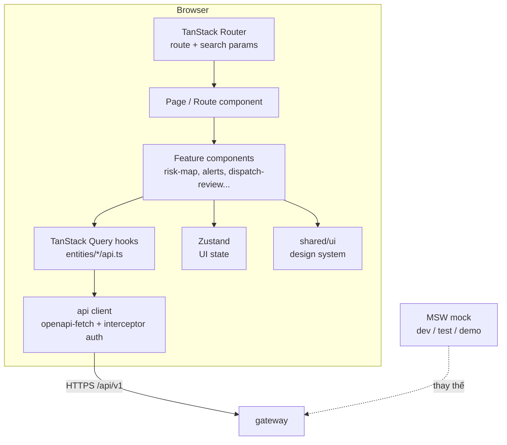

# 10 — Kiến trúc Frontend (dashboard)

> **Trạng thái:** v1.0 — bản chốt để bắt đầu code (2026-09-25). Thay đổi quyết định trong tài liệu này phải qua ADR ([09 §17.2](09-kien-truc-backend.md#172-adr-architecture-decision-record)).
> **Đọc trước:** [09-kien-truc-backend.md](09-kien-truc-backend.md) §3–§8 (service, API, luồng nghiệp vụ) và [07-model-card.md](07-model-card.md) §2, §11, §12 (mô hình được nói gì, không được nói gì).
> **Ai đọc:** người viết frontend, người review PR `dashboard/`.

Frontend là nơi **người ra quyết định nhìn thấy mô hình**. Một con số trình bày sai (thiếu base rate, dữ liệu ước lượng trông như thật, dự báo không có ngữ cảnh độ tin cậy) có thể dẫn tới quyết định y tế sai. Vì vậy tài liệu này đặt **luật trình bày số liệu trung thực (§9)** ngang hàng với luật kỹ thuật. **PHẢI** = luật (CI/review chặn); **NÊN** = khuyến nghị mạnh.

---

## Mục lục

1. [Nguyên tắc](#1-nguyên-tắc)
2. [Hiện trạng và hướng chuyển đổi](#2-hiện-trạng-và-hướng-chuyển-đổi)
3. [Stack đã chốt](#3-stack-đã-chốt)
4. [Kiến trúc ứng dụng](#4-kiến-trúc-ứng-dụng)
5. [Cấu trúc thư mục & luật phụ thuộc](#5-cấu-trúc-thư-mục--luật-phụ-thuộc)
6. [Quản lý trạng thái](#6-quản-lý-trạng-thái)
7. [Tích hợp API](#7-tích-hợp-api)
8. [Màn hình & đặc tả chức năng](#8-màn-hình--đặc-tả-chức-năng)
9. [Luật trình bày số liệu trung thực](#9-luật-trình-bày-số-liệu-trung-thực)
10. [Design system & giao diện](#10-design-system--giao-diện)
11. [Bản đồ & biểu đồ](#11-bản-đồ--biểu-đồ)
12. [Form & luồng duyệt (human-in-the-loop)](#12-form--luồng-duyệt-human-in-the-loop)
13. [Trạng thái tải, lỗi, rỗng, xuống cấp](#13-trạng-thái-tải-lỗi-rỗng-xuống-cấp)
14. [Bảo mật phía client](#14-bảo-mật-phía-client)
15. [Hiệu năng](#15-hiệu-năng)
16. [Kiểm thử & CI](#16-kiểm-thử--ci)
17. [Quy ước viết code](#17-quy-ước-viết-code)
18. [Quy trình làm việc](#18-quy-trình-làm-việc)
19. [Build, cấu hình, triển khai](#19-build-cấu-hình-triển-khai)
20. [Kế hoạch triển khai theo đợt](#20-kế-hoạch-triển-khai-theo-đợt)

---

## 1. Nguyên tắc

1. **Một cửa API.** Frontend chỉ gọi `gateway` qua `/api/v1`. Không gọi thẳng service nội bộ, không gọi LLM, không tự tính mô hình.
2. **Frontend không tính ra số nghiệp vụ.** Mọi con số (dự báo, xác suất, ngưỡng, ngân sách phân bổ) đến từ API. Frontend chỉ **định dạng** và **so sánh hiển thị**. (Bản prototype tự chạy greedy phía client — sẽ bỏ ở bản thật, xem §2.)
3. **Hợp đồng quyết định kiểu dữ liệu.** Type TypeScript **sinh** từ `contracts/openapi/public-v1.yaml`, không viết tay type cho response API.
4. **Không có con số mồ côi.** Mọi số liệu hiển thị kèm đơn vị, nguồn dữ liệu, phiên bản mô hình/dữ liệu và độ tin cậy (§9).
5. **Con người quyết định.** Giao diện không có nút nào gây tác động ra ngoài mà không qua màn hình duyệt với xác nhận rõ ràng (§12).
6. **Tiếng Việt trước, dễ tiếp cận.** Người dùng là cán bộ y tế, không phải kỹ sư dữ liệu: ngôn ngữ đời thường, WCAG 2.1 AA.
7. **Xuống cấp chứ không sập.** Một phần lỗi thì phần còn lại vẫn dùng được, và người dùng biết phần nào đang cũ/lỗi.
8. **URL là trạng thái chia sẻ được.** Bộ lọc quan trọng (lượt dự báo, tầm dự báo, vùng, tỉnh) nằm trên URL — gửi link là người kia thấy đúng màn hình đó.

---

## 2. Hiện trạng và hướng chuyển đổi

`dashboard/` hiện là **prototype một trang** (Hero, RiskMap, ProvinceRanking, OptimizationPreview, DispatchPreview…), đọc JSON tĩnh `public/data/risk_summary.json`, deploy Vercel, gắn nhãn "Minh hoạ" rõ ràng.

**Quyết định:**
- Giữ **một SPA duy nhất** trong `dashboard/`, chia 2 vùng route:
  - `/` và `/gioi-thieu/*` — **công khai**, nội dung giới thiệu (kế thừa prototype), không cần đăng nhập, không gọi API cần xác thực.
  - `/app/*` — **console** cho cán bộ, cần đăng nhập, gọi API thật.
- Tái cấu trúc code prototype vào cấu trúc §5 **dần dần**; không viết lại từ đầu những gì đang chạy tốt (bản đồ Leaflet, thang màu).
- Bỏ logic phân bổ greedy phía client khi `optimize` có API (đợt 2); trước đó giữ nguyên nhãn "Minh hoạ khái niệm".
- Bản Vercel công khai tiếp tục chạy ở **chế độ demo** với dữ liệu mock (MSW, §19.3) — không bao giờ trỏ vào backend pilot.
- Không làm micro-frontend: 1 đội, 1 sản phẩm — chi phí không đáng.

---

## 3. Stack đã chốt

| Mảng | Chọn | Ghi chú / lý do |
|---|---|---|
| Ngôn ngữ | **TypeScript 6**, `strict: true` | + `noUncheckedIndexedAccess`, `exactOptionalPropertyTypes`, `noImplicitOverride` — đã bật, `tsc -b` sạch |
| Framework | **React 19** | đã có |
| Build | **Vite** | đã có |
| Router | **TanStack Router** (định tuyến theo file, `@tanstack/router-plugin`) | route và **search params có kiểu** (lọc theo run/horizon/vùng nằm trên URL, được validate), tách chunk theo route tự động. ✅ Đợt 0 |
| Server state | **TanStack Query v5** | đã có; cache, retry, invalidation |
| Client state | **Zustand** | chỉ cho trạng thái UI toàn cục nhỏ (xem §6). ⏳ *Thêm khi có state UI đầu tiên (Đợt 1)*; token truy cập hiện nằm ở `shared/api/session.ts` (bộ nhớ thuần) |
| API client | **openapi-typescript** + **openapi-fetch** | type sinh từ hợp đồng, client mỏng. ✅ Đợt 0. *Lưu ý:* `openapi-typescript` 7.x khai peer `typescript@^5` nên `package.json` có `overrides` trỏ về TS 6 của dự án (đã kiểm sinh mã đúng và ổn định) |
| Form | **React Hook Form** + **Zod** | validate phía client (UX), server vẫn validate lại. Zod ✅ đã dùng (kiểm biến môi trường); ⏳ RHF thêm cùng form đầu tiên (đăng nhập, Đợt 1) |
| Styling | **Tailwind CSS v4** | đã có; token trong `@theme` (§10) |
| Component nền | **Radix UI Primitives** (dialog, dropdown, tabs, tooltip, toast…) | có sẵn a11y (focus trap, ARIA); tự style bằng Tailwind. ⏳ *Thêm từng gói khi component đầu tiên cần (Dialog cho `ConfirmDialog`…)* |
| Bản đồ | **Leaflet + react-leaflet** | đã có |
| Biểu đồ | **Recharts** | đủ cho chuỗi thời gian, dải khoảng, cột; nhẹ hơn ECharts. ⏳ *Thêm cùng màn hình S3 (Đợt 1)* |
| Icon | lucide-react | đã có |
| Animation | Framer Motion (tên mới `motion`) | chỉ cho trang giới thiệu; console hạn chế animation (§10.5) |
| Ngày tháng | `Intl.DateTimeFormat` + tiện ích nhỏ tự viết cho `"YYYY-MM"` | không thêm thư viện ngày |
| Markdown dự thảo | `react-markdown` + `rehype-sanitize` | hiển thị dự thảo văn bản an toàn |
| Lint | **oxlint** + **Prettier** | ✅ Đợt 0. Ngoài luật chuẩn: cấm `any`, `console`, **`fetch` ngoài `shared/api`**, `import/no-cycle`. CONTRIBUTING đã cập nhật từ ESLint sang oxlint |
| Ranh giới import | **dependency-cruiser** | ✅ Đợt 0 — kiểm luật §5.2 trong CI (10 luật, đã kiểm bằng cách cố ý vi phạm) |
| Test | **Vitest** + **Testing Library** + **MSW** + **Playwright** + `@axe-core/playwright` | §16. ✅ Đợt 0 |
| Ngân sách bundle | script `scripts/check-bundle-size.mjs` (gzip từng chunk) | không thêm thư viện `size-limit`; ngân sách ở §15 |

Thêm thư viện mới **PHẢI** nêu trong PR: lý do, kích thước gzip (bundlephobia), giấy phép, có thay được bằng thứ đã có không.

---

## 4. Kiến trúc ứng dụng



- **Route** chịu trách nhiệm: đọc search params, kiểm quyền vào trang, prefetch dữ liệu (loader gọi `queryClient.ensureQueryData`).
- **Feature** chứa logic màn hình, ghép component, gọi hook dữ liệu.
- **Entity** chứa hook truy vấn + định dạng hiển thị của 1 khái niệm miền (tỉnh, lượt dự báo, cảnh báo…).
- **Shared** không biết gì về nghiệp vụ.

---

## 5. Cấu trúc thư mục & luật phụ thuộc

### 5.1 Cấu trúc

```
dashboard/
├── src/
│   ├── app/                     # khởi động ứng dụng
│   │   ├── main.tsx
│   │   ├── providers.tsx        # QueryClient, Router, Toast, Auth
│   │   ├── router.tsx
│   │   └── routes/              # định nghĩa route (file-based của TanStack Router)
│   │       ├── __root.tsx
│   │       ├── index.tsx                    # trang giới thiệu công khai
│   │       ├── dang-nhap.tsx
│   │       └── app/
│   │           ├── route.tsx                # layout console + guard đăng nhập
│   │           ├── ban-do.tsx               # /app/ban-do
│   │           ├── tinh.$provinceId.tsx
│   │           ├── canh-bao.tsx
│   │           ├── ho-so.$caseId.tsx
│   │           ├── du-thao.$draftId.tsx
│   │           ├── luot-du-bao.tsx
│   │           ├── mo-hinh.tsx
│   │           └── quan-tri/...
│   ├── features/                # một thư mục / tính năng màn hình
│   │   ├── auth/
│   │   ├── risk-map/
│   │   ├── province-detail/
│   │   ├── alerts/
│   │   ├── cases/
│   │   ├── allocation/
│   │   ├── dispatch-review/
│   │   ├── forecast-runs/
│   │   ├── model-info/
│   │   ├── admin/
│   │   └── landing/             # code prototype chuyển vào đây
│   ├── entities/                # khái niệm miền: hook API + định dạng
│   │   ├── province/
│   │   ├── forecast/
│   │   ├── alert/
│   │   ├── draft/
│   │   └── user/
│   ├── shared/
│   │   ├── api/
│   │   │   ├── schema.gen.ts    # SINH TỰ ĐỘNG — không sửa tay
│   │   │   ├── client.ts        # openapi-fetch + middleware auth/request-id
│   │   │   ├── errors.ts        # map problem+json code → thông điệp
│   │   │   └── query-keys.ts
│   │   ├── ui/                  # design system (§10)
│   │   ├── lib/                 # format số/ngày, tiện ích thuần
│   │   ├── i18n/vi.ts           # toàn bộ chuỗi giao diện
│   │   └── config/env.ts        # đọc & validate biến VITE_*
│   └── mocks/                   # MSW handlers + fixture
├── e2e/                         # Playwright
├── public/
└── .dependency-cruiser.cjs
```

Mỗi thư mục trong `features/` và `entities/` có `index.ts` làm **cổng công khai** — bên ngoài chỉ import qua `index.ts`, không import sâu vào file bên trong.

### 5.2 Luật phụ thuộc (PHẢI — dependency-cruiser chặn)

```
app  →  features  →  entities  →  shared
```

- Chỉ được import **xuống** theo chiều mũi tên, không import ngược lên.
- `features/A` **không** import `features/B`. Cần chia sẻ → đẩy xuống `entities` hoặc `shared`, hoặc ghép ở tầng route.
- `shared/` không import từ `entities`/`features`/`app`.
- Chỉ `shared/api/client.ts` được gọi `fetch`. Component không gọi `fetch` trực tiếp.
- `schema.gen.ts` chỉ được import từ `shared/api` và `entities/*`.

---

## 6. Quản lý trạng thái

| Loại trạng thái | Nơi giữ | Ví dụ |
|---|---|---|
| **Dữ liệu từ server** | TanStack Query (duy nhất) | dự báo, cảnh báo, dự thảo, người dùng hiện tại |
| **Trạng thái chia sẻ qua URL** | search params (TanStack Router, validate bằng Zod) | `run_id`, `horizon`, `region`, `province_id`, trang/cursor |
| **Trạng thái form** | React Hook Form | sửa dự thảo, tạo phương án |
| **UI toàn cục** | Zustand | sidebar thu gọn, lớp bản đồ đang bật, token truy cập trong bộ nhớ |
| **UI cục bộ** | `useState` | tooltip mở, tab đang chọn trong 1 card |

Luật:
- **KHÔNG** sao chép dữ liệu server vào Zustand/useState (nguồn gốc của dữ liệu lệch).
- Query key sinh từ factory `shared/api/query-keys.ts`:

```ts
export const qk = {
  riskMap: (runId: string, horizon: Horizon) => ["risk-map", runId, horizon] as const,
  provinceForecasts: (provinceId: string, runId: string) =>
    ["province", provinceId, "forecasts", runId] as const,
  alerts: (f: AlertFilter) => ["alerts", f] as const,
  draft: (id: string) => ["draft", id] as const,
};
```

- `staleTime` theo bản chất dữ liệu:

| Dữ liệu | staleTime | Lý do |
|---|---|---|
| Danh mục tỉnh, GeoJSON, model card | `Infinity` (theo phiên bản) | bất biến theo version |
| Kết quả một forecast run | `Infinity` | run đã xong là bất biến |
| Danh sách forecast run, trạng thái job | 10 s + polling khi đang chạy | thay đổi |
| Cảnh báo, hồ sơ, dự thảo | 30 s + invalidate sau mutation | nhiều người cùng xử lý |

- Mutation duyệt/gửi **không dùng optimistic update** (§12). Mutation nhẹ (đánh dấu đã xem) được phép optimistic.

---

## 7. Tích hợp API

### 7.1 Sinh type và client

```bash
npm run api:gen   # openapi-typescript ../contracts/openapi/public-v1.yaml -o src/shared/api/schema.gen.ts
```

- CI chạy `api:gen` rồi `git diff --exit-code` — hợp đồng đổi mà quên sinh lại là fail.
- Dùng tên trường **snake_case đúng như API** (không chuyển camelCase) để tra cứu với backend/DB không phải dịch.

### 7.2 Client & middleware

`shared/api/client.ts` là nơi duy nhất:
- gắn `Authorization: Bearer <access token từ bộ nhớ>`;
- gắn `X-Request-ID` (UUID) — hiển thị mã này trong thông báo lỗi để người dùng báo lại;
- gắn `Idempotency-Key` cho mọi `POST` tạo/tác dụng phụ (sinh 1 lần cho mỗi lần người dùng bấm, giữ nguyên khi retry);
- gắn `If-Match` khi cập nhật tài nguyên có `ETag`;
- xử lý **401 → gọi `/auth/refresh` đúng 1 lần** (các request song song chờ chung 1 promise refresh) → thử lại; refresh thất bại → xoá phiên, về `/dang-nhap?redirect=...`;
- parse lỗi `application/problem+json` thành `ApiError { status, code, detail, requestId, fieldErrors }`.

### 7.3 Xử lý lỗi theo `code`

`shared/api/errors.ts` ánh xạ `code` (danh mục `contracts/errors.md`) → thông điệp tiếng Việt thân thiện + hành động gợi ý. Không hiển thị `detail` thô của server cho lỗi 5xx. `code` lạ → thông điệp chung + `request_id`.

| Nhóm | Cách hiển thị |
|---|---|
| 400 validation | lỗi gắn vào từng trường form (`errors[].field`) |
| 401 | tự refresh; thất bại → đăng nhập lại, giữ URL để quay về |
| 403 | trang/khối "Bạn không có quyền…" + vai trò cần có |
| 404 | trang "Không tìm thấy" có đường quay lại |
| 409 / 412 | "Dữ liệu vừa được người khác thay đổi" + nút tải lại, **không** tự ghi đè |
| 429 | "Thao tác quá nhanh, thử lại sau N giây" |
| 5xx / mạng | khối lỗi có nút thử lại + `request_id` |

### 7.4 Mock theo hợp đồng

- MSW handler trong `src/mocks/` trả dữ liệu **khớp type sinh** (TypeScript kiểm), fixture lấy từ ví dụ trong OpenAPI và từ số thật của exp_016 cho vài origin.
- Nhờ đó frontend làm song song với backend ngay khi PR hợp đồng merge (09 §17.1).

---

## 8. Màn hình & đặc tả chức năng

Mỗi màn hình dưới đây là 1 issue lớn; khi làm phải có: mục đích, vai trò được vào, dữ liệu, thành phần, trạng thái đặc biệt, luật trung thực áp dụng.

| # | Màn hình (route) | Vai trò | Mục đích | Đợt |
|---|---|---|---|---|
| S0 | Giới thiệu `/` | công khai | Kể câu chuyện sản phẩm (từ prototype) | có sẵn |
| S1 | Đăng nhập `/dang-nhap` | công khai | Đăng nhập | 1 |
| S2 | **Bản đồ rủi ro** `/app/ban-do` | viewer+ | Tổng quan 34 tỉnh cho 1 lượt dự báo và 1 tầm dự báo | 1 |
| S3 | **Chi tiết tỉnh** `/app/tinh/$provinceId` | viewer+ | Chuỗi quan sát + dự báo, xác suất vượt ngưỡng, yếu tố ảnh hưởng (SHAP) | 1 |
| S4 | Lượt dự báo `/app/luot-du-bao` | analyst | Danh sách run, tạo run backtest, theo dõi trạng thái job | 1 |
| S5 | **Mô hình & giới hạn** `/app/mo-hinh` | viewer+ | Model card rút gọn, giới hạn đã biết, độ tin cậy theo vùng | 1 |
| S6 | Cảnh báo `/app/canh-bao` | officer+ | Hộp cảnh báo mở, lọc theo vùng/mức, xác nhận đã xem, mở hồ sơ | 2 |
| S7 | Hồ sơ `/app/ho-so/$caseId` | officer+ | Gom cảnh báo, phương án phân bổ, dự thảo, lịch sử | 2 |
| S8 | Phân bổ (trong S7) | officer+ | Tạo phương án với ngân sách/ràng buộc, xem giải thích | 2 |
| S9 | **Duyệt dự thảo** `/app/du-thao/$draftId` | officer (sửa) / approver (duyệt) | Xem/sửa dự thảo, kết quả guardrail, duyệt/từ chối | 3 |
| S10 | Lệnh & trạng thái gửi (trong S7) | officer+ | Theo dõi giao, gửi lại | 3 |
| S11 | Quản trị `/app/quan-tri/*` | admin | Người dùng, vai trò, nhật ký kiểm toán | 3 |

### 8.1 S2 — Bản đồ rủi ro (chi tiết mẫu)

- **Thanh điều khiển** (lưu trên URL): chọn lượt dự báo (mặc định: run `completed` mới nhất), tầm dự báo h ∈ {1,2,3,6}, chỉ số tô màu (`exceed_prob` hoặc `cases_pred` theo 100k dân), lọc vùng.
- **Bản đồ**: 34 tỉnh tô theo lớp rời rạc (§11), viền đậm tỉnh có cảnh báo mở; hover → tooltip (tên, số dự báo, xác suất + base rate, nguồn dữ liệu); click → S3.
- **Bảng song song** (bắt buộc — thay thế bản đồ cho bàn phím/trình đọc màn hình): xếp hạng tỉnh, sắp xếp được, cùng dữ liệu với bản đồ.
- **Băng thông tin** phía trên: chế độ run (`backtest` → banner "Tái hiện lịch sử: dự báo từ tháng neo 03/2010, dữ liệu thật"), phiên bản mô hình/dữ liệu, thời điểm tạo.
- **Chú giải**: thang màu + ý nghĩa + base rate của tầm dự báo đang xem.
- `warnings[]` từ BFF → hiển thị khối cảnh báo nhỏ (vd "không tải được cảnh báo, hiển thị dự báo").

### 8.2 S3 — Chi tiết tỉnh

- Biểu đồ: quan sát thực tế (đường liền, nét khác cho `estimated`/`imputed`) + dự báo 4 điểm h=1,2,3,6 (điểm + đường nét đứt) + đường ngưỡng P75 theo tháng.
- Khoảng dự báo: **chỉ vẽ khi API trả `cases_pred_interval` khác null** (hiện là null — 09 §10.2). Không tự vẽ dải "cho đẹp".
- Thẻ xác suất vượt ngưỡng: `41%` kèm dòng "Mức nền: 35% tháng vượt ngưỡng" (§9).
- Yếu tố ảnh hưởng: top-5 SHAP dạng thanh ngang, nhóm theo họ đặc trưng (ca bệnh gần đây / mức mùa vụ / khí hậu), tên đặc trưng dịch sang tiếng Việt dễ hiểu; ghi chú "giải thích mô hình, không phải quan hệ nhân quả".
- Khối độ tin cậy vùng + các `flags` (§9.3).

### 8.3 S5 — Mô hình & giới hạn

Hiển thị từ `/model-card` và `/model-card/limitations` (không chép cứng vào frontend): mục đích dùng / không dùng, hiệu năng nhiều mùa (so với B3), độ tin cậy theo vùng, danh sách giới hạn L1–L12. Mọi màn hình có số liệu đều có link "Giới hạn của mô hình" tới đây.

---

## 9. Luật trình bày số liệu trung thực

Đây là phần **đặc thù và bắt buộc** của DengueSense. Mỗi luật ánh xạ tới một mục trong model card; reviewer kiểm từng luật cho PR có hiển thị số liệu.

### 9.1 Mười luật (PHẢI)

| # | Luật | Nguồn |
|---|---|---|
| T1 | Xác suất vượt ngưỡng **luôn** hiển thị cùng **mức nền (base rate)** | model card §12.1 |
| T2 | Dữ liệu `estimated`/`imputed`/`simulated` luôn có **nhãn** (badge + kiểu nét/hoa văn khác trên biểu đồ/bản đồ), không bao giờ trông giống `real` | docs/01, prototype |
| T3 | Mọi màn hình số liệu có **dải provenance**: chế độ run, tháng neo, phiên bản mô hình, phiên bản dữ liệu, thời điểm tạo | 09 §6.5 |
| T4 | Chế độ `backtest` có **banner** "Tái hiện lịch sử"; chế độ `live_experimental` có banner cảnh báo "ngoài giai đoạn đã kiểm chứng / đầu vào ước lượng" | model card §2 |
| T5 | Hiển thị **độ tin cậy theo vùng** khi xem tỉnh/vùng (Trung: cao; Bắc: thấp ở năm dịch bất thường; Nam: ngang dự báo theo mùa) | model card §12.4 |
| T6 | Cờ `outbreak_underprediction_risk` → ghi chú "mô hình có xu hướng dự báo thấp khi bùng dịch — cần chuyên môn xem xét" | model card §12.5 |
| T7 | **Không vẽ khoảng tin cậy** khi API không trả; không làm tròn gây hiểu sai (xác suất làm tròn tới %, số ca làm tròn nguyên, không hiện `0.4123456`) | 09 §10.2 |
| T8 | **Không dùng ngôn ngữ tuyệt đối**: "dự báo", "ước tính", "khả năng" — không "sẽ xảy ra", "chắc chắn"; không viết "báo trước 5–9 tuần" | model card §7.3 |
| T9 | Chỉ số màu không phải kênh duy nhất: kèm chữ/nhãn mức, và thang màu an toàn cho mù màu | WCAG 1.4.1 |
| T10 | Mọi chỗ còn là minh hoạ (chưa nối API thật) có tag "Minh hoạ khái niệm" | README dashboard |

### 9.2 Thành phần dùng chung để tuân thủ (PHẢI dùng, không tự dựng lại)

- `<ProvenanceBar meta={...} />` — T3, T4.
- `<DataSourceBadge source="estimated" />` — T2.
- `<ProbabilityWithBaseRate p={0.41} baseRate={0.35} />` — T1, T7.
- `<ReliabilityNote region="Bắc" />` + `<ForecastFlags flags={[...]} />` — T5, T6.
- `<IllustrativeTag />` — T10.

Có test đơn vị cho từng component này (vd `ProbabilityWithBaseRate` không render được nếu thiếu `baseRate` — ép bằng type bắt buộc).

### 9.3 Định dạng số & ngày (tiếng Việt)

| Loại | Định dạng | Ví dụ |
|---|---|---|
| Số ca | `Intl.NumberFormat('vi-VN')`, làm tròn nguyên | `1.234 ca` |
| Tỉ lệ / 100k dân | 1 chữ số thập phân | `12,3 / 100.000 dân` |
| Xác suất | phần trăm nguyên | `41%` |
| Tháng | `MM/YYYY` | `03/2010` |
| Thời điểm | `dd/MM/yyyy HH:mm` giờ Việt Nam | `25/09/2026 09:14` |
| Tầm dự báo | "sau N tháng" | `sau 3 tháng (06/2010)` |

Tất cả qua `shared/lib/format.ts` — không gọi `toFixed`/`toLocaleString` rải rác.

---

## 10. Design system & giao diện

### 10.1 Token (biến CSS trong `src/app/index.css`)

Giữ nguyên **ngôn ngữ thiết kế của prototype** (tối là mặc định, kính mờ tiết chế) thay vì đổi tên hàng loạt — token
đã mang nghĩa (không phải màu thô). Tên thực tế:

- **Nền / chữ / viền:** `--bg-page`, `--bg-surface`, `--bg-surface-2`, `--bg-surface-hover`; `--ink-primary`, `--ink-secondary`, `--ink-muted`; `--border-hairline`, `--border-strong`.
- **Thương hiệu:** `--accent` (chữ/viền/biểu tượng trên nền tối), **`--accent-solid`** (nền đặc của nút/liên kết chữ trắng — `#3987e5` chỉ đạt 3,6:1, `#2a6fd0` đạt 4,9:1), `--accent-soft`, `--accent-ink`.
- **Trạng thái cố định:** `--status-good/warning/serious/critical` — không dùng cho series dữ liệu khác.
- **Thang rủi ro:** `--risk-1` … `--risk-8` (tuần tự đỏ, ColorBrewer `Reds`) cho trang giới thiệu. Console dùng **lớp rời rạc có ngưỡng cố định** (§11.1): khi làm S2, thêm `--risk-class-1..5` (chọn từ thang trên hoặc `YlOrRd`) — không co giãn theo min/max từng lần.
- **Nguồn dữ liệu:** thêm `--src-real`, `--src-estimated` (+ hoa văn gạch chéo trên bản đồ) khi làm S2.
- Font: **Inter** (thân) + **Space Grotesk** (tiêu đề), hỗ trợ tiếng Việt đầy đủ; cỡ chữ nền 16 px.
- **Luật tương phản (đã có test axe):** chữ ≥ 4,5:1 trên MỌI nền bề mặt kể cả `--accent-soft`; đổi giá trị token phải chạy lại `npm run test:e2e`. `--ink-muted` đã được nâng lên `#9a9891` vì `#898781` chỉ đạt 4,4:1 trên nền accent-soft.
- Chế độ sáng: **NÊN** hỗ trợ bằng redefine token; không bắt buộc ở Đợt 1.

### 10.2 Thư viện component `shared/ui`

`Button`, `IconButton`, `Input`, `Select`, `Textarea`, `Checkbox`, `Dialog`, `ConfirmDialog`, `Drawer`, `Tabs`, `Tooltip`, `Toast`, `Badge`, `Card`, `Table` (sắp xếp, trạng thái rỗng), `Skeleton`, `EmptyState`, `ErrorState`, `PageHeader`, `Pagination` (cursor), `Stat`.
Mỗi component: nhận `className` để mở rộng, có trạng thái disabled/focus rõ, hỗ trợ bàn phím, có ví dụ dùng (file `*.stories.tsx` hoặc trang `/app/_ui` chỉ bật ở dev — chọn trang dev để khỏi thêm Storybook).

### 10.3 Bố cục console

- Khung: thanh trên (tên hệ thống, chọn lượt dự báo nhanh, người dùng) + thanh bên (điều hướng theo vai trò) + nội dung.
- **Desktop trước** (≥ 1280 px là mục tiêu chính); tablet ≥ 768 px dùng được cho màn hình duyệt; điện thoại: chỉ đảm bảo đọc được bản đồ/cảnh báo, không tối ưu thao tác soạn thảo.
- Thanh bên chỉ hiện mục người dùng có quyền (nhưng quyền thật do backend kiểm).

### 10.4 Tiếp cận (WCAG 2.1 AA — PHẢI)

- Tương phản chữ ≥ 4.5:1; tương tác được bằng bàn phím hoàn toàn; focus luôn thấy được.
- Mọi biểu đồ/bản đồ có **bảng dữ liệu thay thế** hoặc mô tả văn bản.
- Form: `label` gắn với input, lỗi đọc được bởi trình đọc màn hình (`aria-describedby`).
- `lang="vi"` trên `<html>`.
- CI chạy axe trên các trang chính (§16).

### 10.5 Chuyển động

Console: chỉ chuyển động ngắn (≤ 200 ms) cho phản hồi thao tác; tôn trọng `prefers-reduced-motion`. Hiệu ứng lớn chỉ ở trang giới thiệu.

### 10.6 Ngôn ngữ giao diện

- Toàn bộ chuỗi trong `shared/i18n/vi.ts` (object có kiểu) — **không** viết chuỗi hiển thị cứng trong JSX, để dễ rà soát câu chữ (T8) và dịch về sau. Chưa cần thư viện i18n.
- Giọng văn: ngắn, hành động rõ, thuật ngữ đời thường ("mức nền" thay vì "base rate"; "tầm dự báo" thay "horizon"). Bảng thuật ngữ đồng bộ với 09 §5.2.

---

## 11. Bản đồ & biểu đồ

### 11.1 Bản đồ

- GeoJSON lấy từ `GET /geo/provinces?version=` (cache theo version, `staleTime: Infinity`); bản prototype đã đơn giản hoá còn ~600 KB — giữ mức ≤ 700 KB, phục vụ nén gzip/brotli.
- Tô màu theo **lớp rời rạc** với ngưỡng cố định và có nghĩa (không dùng thang liên tục co giãn theo min/max từng lần — màu phải so sánh được giữa các lượt):
  - `exceed_prob`: `<20% · 20–40% · 40–60% · 60–80% · ≥80%`.
  - `cases_pred` / 100k: ngưỡng từ phân vị lịch sử toàn quốc, do API trả trong `legend` (frontend không tự tính).
- Tỉnh thiếu dữ liệu: màu xám + hoa văn, tooltip "không có dự báo".
- Tỉnh có `estimated_inputs`: viền nét đứt.
- Nền bản đồ: tile OSM/CARTO nhạt; ghi nguồn (attribution) đầy đủ.
- Mọi thao tác trên bản đồ có tương đương ở bảng bên cạnh.

### 11.2 Biểu đồ

- Recharts, bọc trong component `shared/ui/charts/*` với cấu hình thống nhất (font, lưới, tooltip, định dạng trục qua `format.ts`).
- Trục thời gian luôn là tháng; trục số ca bắt đầu từ 0.
- Phân biệt quan sát/dự báo/ngưỡng bằng **kiểu nét + chú giải**, không chỉ bằng màu.
- Không dùng biểu đồ tròn, 3D, trục kép.

---

## 12. Form & luồng duyệt (human-in-the-loop)

### 12.1 Luật chung cho form

- React Hook Form + schema Zod; lỗi hiện dưới trường, tóm tắt lỗi đầu form với form dài.
- Nút submit **disabled trong lúc gửi**, 1 `Idempotency-Key` cho mỗi lần bấm.
- Rời trang khi form có thay đổi chưa lưu → hỏi xác nhận.

### 12.2 Màn hình duyệt dự thảo (S9) — luật bắt buộc

- Bố cục 2 cột: **trái** = dự thảo (xem/sửa); **phải** = bằng chứng: số liệu nguồn (slot từ Layer 1/2, kèm provenance), kết quả guardrail G1–G6 (đạt/không đạt/cờ), trích dẫn văn bản, lịch sử phiên bản.
- Số trong dự thảo được **tô sáng** và đối chiếu với slot (dữ liệu G1 do `genai` trả) — cán bộ thấy ngay số nào lấy từ đâu.
- Phần `[CẦN BỔ SUNG]` tô nổi bật; **không cho duyệt** khi còn `[CẦN BỔ SUNG]` (backend cũng chặn).
- Sửa dự thảo → tạo phiên bản mới (`If-Match`), hiển thị diff so với bản máy soạn.
- Nút **Duyệt** chỉ hiện với `approver`; nếu là người soạn và văn bản B2G → nút disabled kèm lý do "cần người khác duyệt".
- Duyệt/Từ chối mở `ConfirmDialog` nêu rõ hậu quả: "Văn bản sẽ được gửi tới: CDC tỉnh X (email …). Không thể thu hồi sau khi gửi." Từ chối **bắt buộc** nhập lý do.
- **Không optimistic update** cho duyệt/gửi: chờ server xác nhận rồi mới đổi trạng thái hiển thị.
- 409 (người khác đã duyệt/sửa) → thông báo + tải lại, không ghi đè.

---

## 13. Trạng thái tải, lỗi, rỗng, xuống cấp

Mọi khối dữ liệu **PHẢI** xử lý đủ 4 trạng thái bằng component chung:

| Trạng thái | Cách hiển thị |
|---|---|
| Đang tải lần đầu | `Skeleton` đúng hình dạng nội dung (không spinner toàn trang) |
| Đang làm mới nền | chỉ báo nhỏ, giữ dữ liệu cũ |
| Lỗi | `ErrorState` có nút thử lại + `request_id`; lỗi một khối không làm sập trang (Error Boundary theo khối) |
| Rỗng | `EmptyState` nói **vì sao** rỗng và việc tiếp theo ("Chưa có lượt dự báo nào — analyst có thể tạo tại Lượt dự báo") |
| Dữ liệu cũ | từ `flags: stale_data` hoặc `warnings[]` → badge "Dữ liệu cập nhật lúc …" |
| Mất mạng | banner toàn cục; query tự thử lại khi có mạng |

Job chạy nền (forecast run, phương án lớn): hiển thị tiến độ bằng polling `GET /jobs/{id}` (2 s → giãn dần tới 10 s), cho phép rời trang và quay lại.

---

## 14. Bảo mật phía client

- **Access token chỉ trong bộ nhớ** (`shared/api/session.ts`; Đợt 1 có thể bọc bằng Zustand, không persist). Refresh token là cookie `HttpOnly` do backend đặt — JS không đọc được. **Cấm** lưu token vào `localStorage`/`sessionStorage`.
- Tải lại trang → gọi `/auth/refresh` để lấy access token mới (cookie tự gửi).
- Không bao giờ dùng `dangerouslySetInnerHTML`; nội dung dự thảo render qua `react-markdown` + `rehype-sanitize`.
- **CSP** (đặt ở caddy/nginx): `default-src 'self'; script-src 'self'; style-src 'self' 'unsafe-inline'; img-src 'self' data: https://*.tile.openstreetmap.org https://*.basemaps.cartocdn.com; connect-src 'self'; frame-ancestors 'none'`.
- Biến `VITE_*` là **công khai** (nằm trong bundle): không bao giờ chứa bí mật. Chỉ chứa URL API, cờ chế độ demo, phiên bản build.
- Ẩn nút theo vai trò chỉ là UX — **quyền thật do backend kiểm**; không dựa vào frontend cho bảo mật.
- Đăng xuất: gọi `/auth/logout`, xoá token bộ nhớ, `queryClient.clear()`.
- `npm audit --omit=dev` trong CI; cập nhật dependency định kỳ mỗi tháng (một PR `chore(dashboard): update deps`).
- Không đưa thông tin cá nhân vào URL (chỉ ID).

---

## 15. Hiệu năng

| Ngân sách (PHẢI, CI đo) | Mục tiêu |
|---|---|
| JS khởi đầu (gzip) cho route console đầu tiên | ≤ 250 KB |
| Mỗi chunk route | ≤ 150 KB gzip |
| LCP (mạng 4G giả lập, máy tầm trung) | ≤ 2,5 s |
| INP | ≤ 200 ms |
| CLS | ≤ 0,1 |

- Code-split theo route (TanStack Router tự động); Leaflet và Recharts chỉ tải ở route cần.
- Prefetch dữ liệu trong loader của route (không waterfall).
- Danh sách dài (> 200 dòng) dùng ảo hoá (`@tanstack/react-virtual`).
- `React.memo`/`useMemo` chỉ khi đo thấy chậm (React Profiler), không dùng bừa.
- Ảnh/nội dung tĩnh phục vụ với cache dài + tên file có hash (Vite mặc định).

---

## 16. Kiểm thử & CI

### 16.1 Tầng kiểm thử

| Tầng | Công cụ | Kiểm gì | Luật |
|---|---|---|---|
| Unit | Vitest | `shared/lib` (format, tính lớp màu hiển thị), `errors.ts`, reducer/store | ≥ 90% dòng cho `shared/lib` |
| Component | Vitest + Testing Library + MSW | feature component với API mock: đủ 4 trạng thái §13, luật T1–T10 | mỗi component §9.2 có test; mỗi feature có test trạng thái lỗi |
| E2E | Playwright chạy trên build + MSW (PR) và trên stack compose thật (nightly) | luồng: đăng nhập → bản đồ → chi tiết tỉnh; (đợt 3) sửa → duyệt dự thảo | luồng chính phải xanh trước release |
| A11y | `@axe-core/playwright` | S1, S2, S3, S5, S9 | 0 vi phạm mức serious/critical |
| Hợp đồng | `api:gen` + `tsc` | type khớp hợp đồng mới nhất | fail khi lệch |

Luật viết test: truy vấn theo vai trò/nhãn như người dùng (`getByRole`, `getByLabelText`), không theo class CSS; không snapshot toàn trang.

### 16.2 CI `ci-dashboard.yml` (thứ tự)

`npm ci` → `api:gen` + `git diff --exit-code` → `oxlint` → `prettier --check` → `tsc --noEmit` → `depcruise` → `vitest run --coverage` → `vite build` → kiểm ngân sách bundle (`size-limit`) → Playwright (MSW) + axe.

Kích hoạt khi đổi `dashboard/**` hoặc `contracts/openapi/public-v1.yaml`.

---

## 17. Quy ước viết code

- **Đặt tên:** component `PascalCase.tsx`; hook `useXxx.ts`; tiện ích `camelCase.ts`; route theo đường dẫn tiếng Việt không dấu (`ban-do.tsx`); hằng `UPPER_SNAKE`.
- Một component / file (trừ component con nhỏ, private).
- Chỉ **function component + hooks**; không class component (trừ Error Boundary nếu cần).
- Props: khai báo `type XxxProps`; không truyền `any`; không spread props vô tội vạ vào DOM.
- TypeScript: cấm `any` (oxlint rule) — trường hợp bất khả kháng dùng `unknown` + thu hẹp kiểu, hoặc ghi comment lý do; cấm `as` ép kiểu dữ liệu API (dữ liệu API đã có type sinh); `switch` trên union phải exhaustive (`assertNever`).
- Không `useEffect` để đồng bộ dữ liệu server (dùng Query) hay để tính giá trị dẫn xuất (tính trực tiếp khi render).
- Không `console.log` trong code merge (oxlint chặn); lỗi runtime báo qua 1 hàm `reportError` (sau này nối Sentry/OTel web — ADR).
- Import theo alias `@/` trỏ `src/`; thứ tự: thư viện → `@/app|features|entities|shared` → tương đối.
- Chú thích: tiếng Việt, giải thích **vì sao**, không giải thích cái code đã nói rõ.

---

## 18. Quy trình làm việc

### 18.1 Quy trình cho một màn hình/tính năng

**Ready:**
- [ ] Issue có: vai trò người dùng, mục đích, tiêu chí chấp nhận, phác thảo bố cục (ảnh chụp giấy/Excalidraw là đủ).
- [ ] Endpoint cần dùng đã có trong `public-v1.yaml` trên `main` (nếu chưa: PR hợp đồng trước — 09 §17.1).
- [ ] Đã xác định luật trung thực T1–T10 nào áp dụng.

**Trình tự làm:**
1. `npm run api:gen` → viết MSW handler + fixture cho endpoint.
2. Hook dữ liệu ở `entities/*` → component ở `features/*` → route.
3. Đủ 4 trạng thái (§13), tiếp cận (§10.4), luật §9.
4. Test component + (nếu là luồng chính) E2E.
5. Chạy với backend thật local (compose) trước khi xin review.
6. PR ≤ ~400 dòng (không tính code sinh), **kèm ảnh chụp màn hình** (desktop + tablet nếu liên quan) và ảnh trạng thái lỗi/rỗng.

**Done:**
- [ ] CI xanh (lint, type, depcruise, test, build, bundle, a11y).
- [ ] Không có chuỗi hiển thị cứng ngoài `vi.ts`.
- [ ] Reviewer đã kiểm checklist §18.2.

### 18.2 Checklist review PR frontend

- [ ] Có gọi `fetch` ngoài `shared/api` hoặc import sai tầng không?
- [ ] Dữ liệu server có bị chép vào state khác không?
- [ ] Bộ lọc quan trọng có nằm trên URL không?
- [ ] Đủ trạng thái tải/lỗi/rỗng/cũ?
- [ ] Luật T1–T10: xác suất có mức nền? nhãn nguồn dữ liệu? provenance? banner chế độ? không vẽ khoảng khi API không có? câu chữ không tuyệt đối?
- [ ] Thao tác không thể hoàn tác có ConfirmDialog nêu hậu quả, không optimistic?
- [ ] Bàn phím dùng được, tương phản đạt, có bảng thay thế cho bản đồ/biểu đồ?
- [ ] Không lưu token vào storage, không `dangerouslySetInnerHTML`?
- [ ] Thư viện mới có lý do + kích thước?

---

## 19. Build, cấu hình, triển khai

### 19.1 Biến môi trường (validate bằng Zod trong `shared/config/env.ts`, sai là không khởi động)

| Biến | Ví dụ | Ý nghĩa |
|---|---|---|
| `VITE_API_BASE_URL` | `/api/v1` | cùng origin qua caddy (tránh CORS) |
| `VITE_APP_MODE` | `console` \| `demo` | `demo` = bật MSW, dùng dữ liệu mock (Vercel) |
| `VITE_BUILD_VERSION` | git sha | hiện ở chân trang, gửi kèm báo lỗi |

### 19.2 Image & phục vụ

- Dockerfile multi-stage: `node:22-alpine` build → `caddy:2-alpine` (hoặc nginx) phục vụ `dist/`, fallback SPA về `index.html`, cache dài cho `/assets/*`, `no-cache` cho `index.html`, header bảo mật + CSP (§14).
- Pilot: dashboard và `/api` **cùng domain** qua caddy (09 §3.3) → cookie `SameSite=Strict` hoạt động, không cần CORS.

### 19.3 Hai kênh phát hành

| Kênh | Nguồn dữ liệu | Mục đích |
|---|---|---|
| Vercel (công khai) | `VITE_APP_MODE=demo` — MSW + fixture từ số thật exp_016, mọi màn hình gắn nhãn "Bản demo" | giới thiệu cuộc thi, không cần backend |
| Staging / pilot (VM) | backend thật | vận hành |

---

## 20. Kế hoạch triển khai theo đợt

Khớp với 09 §18.

### Đợt 0 — Nền móng (1 tuần) — ✅ XONG (2026-09-25)
- [x] Thêm TanStack Router, openapi-fetch/typescript, Zod, Prettier, dependency-cruiser, Vitest + Testing Library + MSW, Playwright + axe. *(RHF, Radix, Recharts, Zustand: thêm khi component/màn hình đầu tiên cần — không thêm phụ thuộc chưa dùng.)*
- [x] Bật `strict` + `noUncheckedIndexedAccess` + `exactOptionalPropertyTypes`; alias `@/`
- [x] Dựng cấu trúc §5; prototype chuyển vào `features/landing` (trang `/` chạy như cũ; tách 3 chunk: khởi đầu 122 KB, route giới thiệu 52 KB, bản đồ Leaflet 45 KB tải lazy ngay sau khi có dữ liệu. **Tổng JS tăng 172 → ~219 KB gzip** do thêm router, Zod, openapi-fetch — vẫn trong ngân sách §15; lợi ích của tách chunk là khung trang hiện sớm hơn, không phải tải ít hơn)
- [x] `shared/api` (client: auth, request-id, **Idempotency-Key bắt buộc cho thao tác ghi**, refresh 401 một lần, problem+json → `ApiError`), `shared/lib/format.ts`, `shared/i18n/vi.ts` (đồng bộ tự động với `contracts/errors.md`), `shared/config/env.ts` (Zod)
- [x] CI `ci-dashboard.yml` đầy đủ §16.2 (kèm kiểm `api:gen` và `routeTree` còn đồng bộ, ngân sách bundle, `npm audit`)
- [x] **Tiếp cận trang giới thiệu (WCAG AA, axe): 0 critical/serious.** Đo lần đầu trên prototype cho thấy lỗi thật, đã sửa: ô trượt ngân sách thiếu nhãn (critical); tương phản chữ ở 77 phần tử (serious; 3 nguyên nhân: chữ `--ink-muted`, nút chữ trắng trên `--accent`, hàng tỉnh bị làm mờ bằng opacity). Thêm hỗ trợ `prefers-reduced-motion`.
- **🚪 Cổng: ĐẠT** — trang giới thiệu chạy như trước (bản đồ 34 tỉnh, xếp hạng, 404); 51 test đơn vị/component + 5 test E2E xanh; `api:gen` chạy với `public-v1.yaml`; dependency-cruiser, oxlint, prettier, `tsc -b` sạch.

### Đợt 1 — Console xem rủi ro (khớp đợt 1 backend) — **đủ cho demo cuộc thi**
- [ ] S1 đăng nhập, layout console, guard route
- [ ] Bộ component trung thực §9.2
- [ ] S2 bản đồ + bảng, S3 chi tiết tỉnh, S4 lượt dự báo, S5 mô hình & giới hạn
- [ ] Chế độ `demo` (MSW) cho Vercel
- **🚪 Cổng:** chọn origin 03/2010 → bản đồ + chi tiết tỉnh hiện số M4-R2 thật từ API, đạt T1–T10, axe 0 lỗi nghiêm trọng, E2E luồng xem xanh.

### Đợt 2 — Cảnh báo & phân bổ
- [ ] S6 cảnh báo, S7 hồ sơ, S8 phân bổ có giải thích (bỏ greedy phía client)

### Đợt 3 — Dự thảo & duyệt
- [ ] S9 duyệt dự thảo đầy đủ §12.2, S10 trạng thái gửi, S11 quản trị
- **🚪 Cổng:** E2E sửa → duyệt → thấy trạng thái SENT; test luật "không duyệt khi còn [CẦN BỔ SUNG]" và "không tự duyệt B2G" xanh.

---

*Lịch sử: v1.0 (2026-09-25) — bản đầu, chốt trước khi code frontend console.*
